# Anubis - Rails Application Documentation Generator

## Context & Setup

**Project Focus**: Este resumo pode ser modelado como um microserviço dedicado a orquestrar o fluxo de envio de alunos pagantes entre diferentes APIs de Instituições de Ensino Superior (IES) e marketplaces. O serviço atua como o orquestrador central para rotas, escopo de operações, logs e retries, fornecendo interfaces estáveis para emissores de dados (sistemas de inscrição) e consumidores (APIs Kroton/Estácio, marketplaces).

## Propósito
- Orquestrar envio de alunos pagantes entre fontes de inscrição e APIs de IES.
- Garantir consistência superficial de dados enquanto facilita integração com novos marketplaces.
- Gerenciar observabilidade e resiliência (logs estruturados, retries automáticos).

## Contexto e limites
- **Context Boundaries**: o serviço foca em “envio de alunos pagantes” e simula a orquestração entre origem (Quero Bolsa), destinos (Kroton, Estácio, Ead.com, Guia da Carreira, Mundo Vestibular) e serviços de inscrição.
- **Condições de sucesso**: payloads corretamente formatados, logs gravados com status, retries bem-sucedidos.
- **Condições de falha**: falhas temporárias acionam backoff/retries; falhas permanentes resultam em dead-letter com registro de motivo.

## Componentes

- **API de Entrada (Ingress)**:  
  - Recebe inscrições de alunos pagantes via Quero Bolsa.  
  - Valida schemas de payload e normaliza formatos.

- **Orquestração de Fluxos**:  
  - Define e gerencia os passos: construção de fluxos atuais (Kroton/Estácio), envio para novos marketplaces e organização de payloads.  
  - Coordena chamadas síncronas (APIs) e/ou mensagens assíncronas.

- **APIs de Destino**:  
  - Kroton, Estácio, Ead.com, Guia da Carreira, Mundo Vestibular.  
  - Tratam as inscrições recebidas e retornam status/erros.

- **Transformação e Normalização de Payloads**:  
  - Converte dados de inscrição para formatos aceitos por cada destino.

- **Logs e Observabilidade**:  
  - Logs estruturados com status das tentativas, timestamps e meta-informação.  
  - Traços distribuídos para correlação entre serviços.

- **Mecanismo de Retry**:  
  - Backoff exponencial com limites, retries automáticos para falhas temporárias.

- **Gerência de Configuração**:  
  - Parâmetros de endpoints, timeouts, limites de retries e mapping de payloads por destino.

## Fluxo de operação (alto nível)

1. Ingestão do payload de inscrição de alunos pagantes pelo Quero Bolsa.
2. Validação e normalização do payload.
3. Construção do fluxo para APIs Kroton/Estácio (ensaiado pelo estado atual).
4. Envio para os destinos existentes (Kroton, Estácio) e, paralelamente, para novos marketplaces (Ead.com, Guia da Carreira, Mundo Vestibular).
5. Registro de logs com o status de cada tentativa.
6. Em caso de falha temporária, disparo de retry com backoff; em falha permanente, encaminhar para dead-letter.
7. Confirmação de sucesso para remetente e atualização de estado.

## Contratos de API (alto nível)
- **Entrada**: payload de inscrição padronizado com campos obrigatórios (identificadores de aluno, dados de pagamento, sinais de consentimento).
- **Saída (Destino)**: resposta com status, código de erro (quando houver) e timestamp.
- **Mensageria opcional**: eventos de envio como “inscrição_enviada” para monitoramento assíncrono.

## Observabilidade e governança
- Logs com: id de transação, id do aluno, destino, status, message, retry_count.
- Métricas: total de envios, taxas de sucesso, falhas, latência por destino, churn de payload.
- Tracing: correlação entre ingestão, orquestração e resposta de destino.

## Boas práticas aplicadas
- Limites de contexto definidos via Domain-Driven Design (DDD) para manter responsabilidade única.
- Protocolos de API estáveis e versionados.
- Padrões de resiliência (timeouts, retries com backoff, circuit breakers) para cada destino.
- Observabilidade completa (logs estruturados, métricas, tracing distribuído).
- Deployment e configuração centralizados para ambientes de produção.

## Extensibilidade
- Adicionar novos destinations marketplace é feito adicionando mapeamentos de payload e endpoints, sem impactar clientes existentes.
- Novos fluxos podem ser introduzidos como tipos de fluxos dentro do orquestrador, mantendo a lógica de retry e logs.

Se desejar, posso converter este design em artefato técnico específico (por exemplo, uma API de gateway, diagrama Mermaid do fluxo, ou pseudocódigo da orquestração). Quer que eu gere algum desses conteúdos?

**Source Materials**:
- Repository: #folder:src/anubis
- Docs: #folder:src/anubis/docs
- Main README: #file:src/anubis/README.md
- Models: #folder:src/anubis/app/models
- Controllers: #folder:src/anubis/app/controllers
- Services: #folder:src/anubis/app/services
- Database Schema: #file:src/anubis/db/schema.rb
- Routes: #file:src/anubis/config/routes.rb
- Configuration: #folder:src/anubis/config
- Gemfile: #file:src/anubis/Gemfile

**Output Location**: Generate comprehensive documentation as `/home/roberto/Projects/project-qeevo-anubis/contents/anubis.md`

**Language**: Portuguese (Brazil)

## Mission

Create comprehensive documentation for the Anubis Rails application by analyzing the codebase and generating a complete technical and business documentation that serves both technical and non-technical stakeholders.

## Global Diagram Styling Constraint
Todas as representações visuais em Mermaid DEVEM:
- Usar paleta de cores PASTEL (tons suaves) para garantir boa leitura em temas claro e escuro.
- Incluir emoticons/emoji apropriados em nós ou rótulos para reforçar semântica visual.
- Definir bloco `init` com `theme: 'base'` e `themeVariables` com contraste suave (ex: primaryColor, secondaryColor, tertiaryColor, lineColor) evitando cores saturadas fortes.
- Utilizar bordas com stroke de baixo contraste e largura entre 1–3px.
- Não usar fundos totalmente pretos (#000) ou totalmente brancos (#FFF) sem matiz (preferir ligeiros tons: #F7FAFC, #F0FFF4, #FFF5F5, #E6FFFA etc.).
- Manter consistência: ícones para tipos (📦 entidade, 🔄 fluxo, 🐘 DB, 📨 eventos, 🧪 testes, 🛡️ segurança, 🌊 AI, 🐳 deploy, 📊 observabilidade).

Se qualquer diagrama futuro não seguir este padrão, ele deve ser ajustado automaticamente antes de gerar a documentação final.

### Mermaid Shared Style Pattern (APLICAR EM TODOS OS DIAGRAMAS)
Use SEMPRE este bloco base (substituindo somente quando houver necessidade explícita de contraste diferente):
````mermaid
%%{init: {
    'theme': 'base',
    'themeVariables': {
        'primaryColor': '#E2F5ED',
        'primaryBorderColor': '#3F8A63',
        'primaryTextColor': '#1F2933',
        'secondaryColor': '#DDEFFC',
        'tertiaryColor': '#FBE9EC',
        'lineColor': '#3A5F85',
        'fontFamily': 'Inter,Segoe UI,Arial'
    }
}}%%
````

Classes recomendadas (quando o tipo de diagrama suportar):
```
classDef layer fill:#E2F5ED,stroke:#3F8A63,stroke-width:1.5px,color:#1F2933;
classDef infra fill:#DDEFFC,stroke:#3A5F85,stroke-width:1.5px,color:#1F2933;
classDef danger fill:#FBE9EC,stroke:#C74B5A,stroke-width:1.5px,color:#1F2933;
classDef accent fill:#E5EFF5,stroke:#7C93A6,stroke-width:1.5px,color:#1F2933;
```

Ícones padrão (manter consistência com Quero Deals):
- Camada / Layer: 🧱 / 🧠 / 🌐
- Entidade de Domínio: 📊 / 🤝 / ⚙️ / 📋
- Segurança / Auth: 🔐
- Infraestrutura: 🐘 (DB), 📨 (Kafka), 🐳 (Deploy), 📦 (Container), 📊 (Métricas)
- Processo / Fluxo: 🔄, ⚙️, 🚀
- Observabilidade: 📝 Logs, 📈 Métricas, 🔍 Tracing

Regra: TODOS os novos diagramas devem reutilizar este "init" e classes antes de qualquer customização.

## Documentation Strategy

### 🏗️ **Rails Application Architecture Analysis**
**Target**: Complete understanding and documentation of the Rails application structure.

**Analysis Actions**:
- Examine Rails MVC architecture implementation
- Analyze models, relationships, and business logic
- Document controllers, routes, and API endpoints
- Identify services, concerns, and design patterns
- Map database schema and migrations
- Document configuration, gems, and dependencies

**Documentation Sections to Generate**:
- Application overview and business purpose
- Rails architecture diagram with MVC components
- Database ERD (Entity Relationship Diagram)
- API endpoints catalog with request/response examples
- Business logic and service layer documentation

#### 🎨 **Git Workflow Diagram**

```mermaid
%%{init: {
    'theme':'base',
    'themeVariables': {
        'primaryColor':'#E2F5ED','primaryBorderColor':'#3F8A63','primaryTextColor':'#1F2933',
        'secondaryColor':'#DDEFFC','tertiaryColor':'#FBE9EC','lineColor':'#3A5F85','fontFamily':'Inter,Segoe UI,Arial'
    }
}}%%
gitGraph
        commit id: "🚀 initial"
        branch develop
        checkout develop
        commit id: "✨ user model"
        commit id: "�️ db setup"
        branch feature/authentication
        checkout feature/authentication
        commit id: "🔐 auth"
        commit id: "🧪 tests"
        checkout develop
        merge feature/authentication
        commit id: "📝 docs"
        branch feature/api-endpoints
        checkout feature/api-endpoints
        commit id: "� api routes"
        commit id: "✅ api tests"
        checkout develop
        merge feature/api-endpoints
        checkout main
        merge develop
        commit id: "🎉 v1.0"
```


#### 💎 **Gem Dependencies Architecture**

```mermaid
%%{init: {
  'theme':'base','themeVariables': {
    'primaryColor':'#E2F5ED','primaryBorderColor':'#3F8A63','primaryTextColor':'#1F2933',
    'secondaryColor':'#DDEFFC','tertiaryColor':'#FBE9EC','lineColor':'#3A5F85','fontFamily':'Inter,Segoe UI,Arial'
  }
}}%%
graph TB
    classDef layer fill:#E2F5ED,stroke:#3F8A63,stroke-width:1.5px,color:#1F2933;
    classDef infra fill:#DDEFFC,stroke:#3A5F85,stroke-width:1.5px,color:#1F2933;
    classDef danger fill:#FBE9EC,stroke:#C74B5A,stroke-width:1.5px,color:#1F2933;
    classDef accent fill:#E5EFF5,stroke:#7C93A6,stroke-width:1.5px,color:#1F2933;

    Rails["🚄 Rails 8.0<br/>Core Framework"]

    subgraph "🗄️ Database Layer"
        PG["🐘 PostgreSQL<br/>pg"]
        AR["📊 ActiveRecord<br/>ORM"]
        Solid["� Solid Cache/Queue"]
    end

    subgraph "🔧 Development Tools"
        Debug["�️ Debug"]
        RSpec["🧪 RSpec"]
        Factory["🏭 FactoryBot"]
        Faker["🎭 Faker"]
    end

    subgraph "🎯 Business Logic"
        AASM["🔄 AASM"]
        Kafka["📨 Kafka (rdkafka/racecar)"]
        Validation["✅ Dry Schema"]
    end

    subgraph "🔐 Quality & Security"
        Brakeman["🛡️ Brakeman"]
        Rubocop["👮 Rubocop"]
        Shoulda["🤝 Shoulda Matchers"]
    end

    subgraph "🚀 Deployment"
        Kamal["🐳 Kamal"]
        Thruster["⚙️ Thruster"]
        Bootsnap["🏃 Bootsnap"]
    end

    subgraph "🤖 AI Integration"
        Tidewave["🌊 Tidewave"]
        FastMCP["⚡ Fast MCP"]
    end

    Rails --> PG & AR & Solid & Debug & RSpec & AASM & Kafka & Kamal & Tidewave
    RSpec --> Factory & Faker & Shoulda
    Tidewave --> FastMCP

    class Rails,AASM,Kafka,Tidewave layer;
    class PG,AR,Solid,Kamal,Thruster,Bootsnap,FastMCP infra;
    class Debug,RSpec,Factory,Faker,Validation,Rubocop,Brakeman,Shoulda accent;
```


### 📋 **Business Domain Modeling**
**Target**: Clear documentation of business concepts and domain logic.

**Analysis Actions**:
- Identify core business entities (Deal, Product Config, Business Rules, etc.)
- Document business workflows and processes
- Map relationships between business concepts
- Analyze business rules and validation logic
- Document integrations with external services

**Documentation Sections to Generate**:
- Business context and domain explanation
- Entity relationship diagrams
- Business workflow diagrams
- Product configuration management
- Commission and deal management processes

### 🔌 **API and Integration Documentation**
**Target**: Complete API documentation with examples and integration guides.

**Analysis Actions**:
- Document all API endpoints (REST/GraphQL)
- Analyze request/response formats and schemas
- Document authentication and authorization
- Identify external API integrations
- Document Kafka event producers/consumers
- Map microservice communication patterns

#### 🔄 **System Integration Flow**

```mermaid
%%{init: {
  'theme':'base','themeVariables': {
    'primaryColor':'#E2F5ED','primaryBorderColor':'#3F8A63','primaryTextColor':'#1F2933',
    'secondaryColor':'#DDEFFC','tertiaryColor':'#FBE9EC','lineColor':'#3A5F85','fontFamily':'Inter,Segoe UI,Arial'
  }
}}%%
flowchart TD
    classDef layer fill:#E2F5ED,stroke:#3F8A63,stroke-width:1.5px,color:#1F2933;
    classDef infra fill:#DDEFFC,stroke:#3A5F85,stroke-width:1.5px,color:#1F2933;
    classDef danger fill:#FBE9EC,stroke:#C74B5A,stroke-width:1.5px,color:#1F2933;
    classDef accent fill:#E5EFF5,stroke:#7C93A6,stroke-width:1.5px,color:#1F2933;

    QueroBolsa["🎓 Quero Bolsa<br/>Source"]
    subgraph Orchestration["🏛️ Orchestration Layer"]
        API["🚪 Ingress API<br/>Validation"]
        Processor["⚙️ Flow Orchestrator"]
        Transformer["🔄 Transformer"]
        Logger["📊 Logs & Metrics"]
        Retry["🔁 Retry Engine"]
    end

    subgraph Destinations["🎯 Destinations"]
        Kroton["🏫 Kroton"]
        Estacio["🎓 Estácio"]
        EadCom["💻 Ead.com"]
        GuiaCarreira["📘 Guia Carreira"]
        MundoVest["🌍 Mundo Vestibular"]
    end

    subgraph Events["📨 Event Streaming"]
        KafkaBus["� Kafka Bus"]
        DeadLetter["💀 DLQ (futuro)"]
    end

    subgraph AI["🤖 AI"]
        Tidewave["🌊 Tidewave"]
        MCPServer["🔌 MCP Server"]
    end

    QueroBolsa --> API --> Processor --> Transformer --> Logger --> Retry
    Retry --> Kroton & Estacio & EadCom & GuiaCarreira & MundoVest
    Processor --> KafkaBus --> DeadLetter
    Tidewave --> MCPServer
    Tidewave -. observability .- Logger

    class API,Processor,Transformer,Logger,Retry layer;
    class Kroton,Estacio,EadCom,GuiaCarreira,MundoVest infra;
    class KafkaBus,DeadLetter infra;
    class Tidewave,MCPServer accent;
```


**Documentation Sections to Generate**:
- Complete API reference with examples
- Authentication and authorization guide
- External integrations catalog
- Event-driven architecture documentation
- Inter-service communication patterns

### 🔧 **Operations and Deployment**
**Target**: Complete operational documentation for deployment and monitoring.

**Analysis Actions**:
- Document deployment pipelines and environments
- Analyze Docker and Kubernetes configurations
- Document monitoring and observability setup
- Identify configuration management patterns
- Document database setup and migrations
- Analyze performance and scaling considerations

**Documentation Sections to Generate**:
- Environment setup and deployment guide
- Configuration management documentation
- Monitoring and observability guide
- Database administration guide
- Performance optimization guidelines

### 👥 **Stakeholder-Focused Documentation**
**Target**: Make technical documentation accessible to different audiences.

**Documentation Approach**:
- Business context explanations for product managers
- Technical details for developers
- Operational guides for DevOps teams
- API guides for integration partners
- Troubleshooting guides for support teams

## Required Documentation Structure

### 1. Application Overview
- Business purpose and context
- Technology stack summary
- Key features and capabilities
- Integration ecosystem overview

### 2. Architecture Documentation
- Rails MVC architecture diagram
- Service layer organization
- Dependency graph of gems
- Database design and relationships
- External dependencies and integrations
- Git workflow and branching strategy

### 3. Business Domain Guide
- Core business entities explanation
- Product configuration management
- Deal and commission workflows
- Business rule engine documentation
- Turbo account management

### 4. API Reference
- Complete endpoint documentation
- Request/response schemas
- Authentication methods
- Error handling patterns
- Rate limiting and best practices

### 5. Database Documentation
- Entity Relationship Diagram (ERD)
- Table descriptions and purposes
- Key relationships and constraints
- Migration patterns and strategies

### 6. Integration Guide
- External API integrations
- Kafka event patterns
- Inter-service communication
- Webhook configurations
- Third-party service dependencies

### 7. Deployment and Operations
- Environment configuration
- Docker and Kubernetes setup
- CI/CD pipeline documentation
- Monitoring and alerting
- Backup and recovery procedures

### 8. Development Guide
- Local development setup
- Testing strategies and patterns
- Code organization conventions
- Contributing guidelines
- Performance considerations

### 9. Troubleshooting and FAQ
- Common issues and solutions
- Error diagnosis guides
- Performance troubleshooting
- Integration debugging
- Support escalation procedures

## Technical Analysis Requirements

### Rails Framework Analysis
- Examine Gemfile for dependencies and versions
- Analyze config/application.rb for Rails configuration
- Document config/routes.rb for API endpoints
- Review app/models for business logic and relationships
- Analyze app/controllers for API patterns
- Document app/services for business service patterns

### Database Schema Analysis
- Parse db/schema.rb for table structures
- Identify model associations and validations
- Document database constraints and indexes
- Map business entity relationships
- Analyze migration patterns

### Business Logic Analysis
- Examine app/services for business processes
- Analyze model validations and business rules
- Document deal and product configuration logic
- Map commission calculation patterns
- Identify event-driven processes

### Integration Analysis
- Examine HTTP client configurations
- Analyze Kafka consumer/producer patterns
- Document external API client implementations
- Map inter-service communication
- Identify authentication and authorization patterns

## Visualization Requirements

### Architecture Diagrams
- Generate Mermaid diagrams for system architecture
- Create ERD diagrams for database relationships
- Document API flow diagrams
- Create business process flowcharts
- Generate deployment architecture diagrams

### Code Examples
- Provide real Ruby/Rails code examples
- Include API request/response examples
- Document configuration examples
- Show integration patterns
- Demonstrate testing patterns

## Output Quality Requirements

### Technical Accuracy
- All code examples must be syntactically correct
- API documentation must reflect actual endpoints
- Configuration examples must be valid
- Database schema must match actual structure

### Business Clarity
- Explain technical concepts in business terms
- Provide context for technical decisions
- Include business impact of technical choices
- Make documentation accessible to non-technical stakeholders

### Completeness
- Cover all major application components
- Document all public APIs
- Include all critical business processes
- Provide comprehensive operational guides

### Usability
- Include table of contents with navigation
- Provide search-friendly section headers
- Use consistent formatting and structure
- Include practical examples and use cases

#### 🛠️ **Development & Deployment Pipeline**

```mermaid
%%{init: {
  'theme':'base','themeVariables': {
    'primaryColor':'#E2F5ED','primaryBorderColor':'#3F8A63','primaryTextColor':'#1F2933',
    'secondaryColor':'#DDEFFC','tertiaryColor':'#FBE9EC','lineColor':'#3A5F85','fontFamily':'Inter,Segoe UI,Arial'
  }
}}%%
graph LR
    classDef layer fill:#E2F5ED,stroke:#3F8A63,stroke-width:1.5px,color:#1F2933;
    classDef infra fill:#DDEFFC,stroke:#3A5F85,stroke-width:1.5px,color:#1F2933;
    classDef danger fill:#FBE9EC,stroke:#C74B5A,stroke-width:1.5px,color:#1F2933;
    classDef accent fill:#E5EFF5,stroke:#7C93A6,stroke-width:1.5px,color:#1F2933;

    subgraph Dev["👨‍💻 Development"]
        Code["💻 Code"] --> Test["🧪 Tests"] --> Lint["👮 Lint"] --> Security["🛡️ Scan"]
    end
    subgraph AI["🤖 AI Tools"]
        TidewaveWeb["� Tidewave UI"]
        MCPVSCode["� MCP VSCode"]
        ClaudeDesktop["🤖 MCP Desktop"]
    end
    subgraph Deploy["🚀 Deployment"]
        Docker["🐳 Docker"] --> Kamal["⚙️ Kamal"] --> Production["🌍 Prod"]
    end
    subgraph Monitor["📊 Monitoring"]
        Logs["📝 Logs"]
        Metrics["📈 Metrics"]
        Alerts["🚨 Alerts"]
    end

    Code -. context .- TidewaveWeb
    Code -. context .- MCPVSCode
    Code -. context .- ClaudeDesktop
    Production --> Logs & Metrics & Alerts

    class Code,Test,Lint,Security layer;
    class Docker,Kamal,Production infra;
    class TidewaveWeb,MCPVSCode,ClaudeDesktop accent;
    class Logs,Metrics,Alerts layer;
```


## Success Criteria

The generated documentation should enable:
1. **New developers** to understand and contribute to the codebase
2. **Product managers** to understand system capabilities and limitations
3. **DevOps teams** to deploy and maintain the application
4. **Integration partners** to successfully integrate with APIs
5. **Support teams** to troubleshoot and resolve issues
6. **Business stakeholders** to understand system functionality and impact