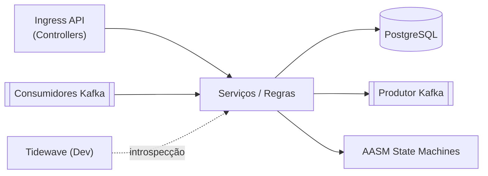
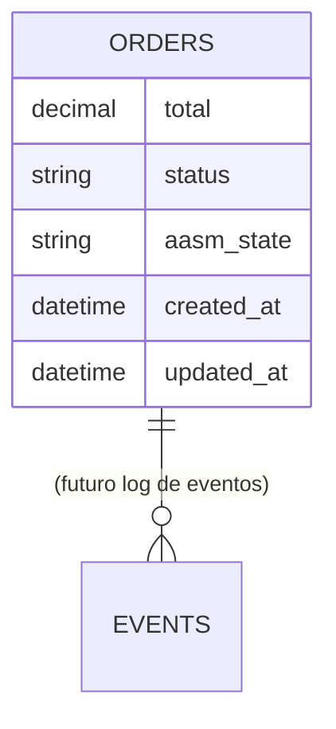
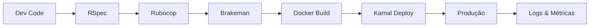

# Anubis - Documentação Técnica e de Domínio

> Geração automática baseada no código-fonte atual (data de geração: 2025-10-01).
>
> Público-alvo: Desenvolvedores, Produto, DevOps, Suporte, Parceiros de Integração.

## Sumário
1. Visão Geral da Aplicação
2. Stack Tecnológica
3. Arquitetura (Rails + Componentes)
4. Domínio de Negócio
5. Modelo de Dados (ERD & Tabelas)
6. API & Endpoints
7. Eventos e Integrações (Kafka)
8. State Machines (AASM)
9. Serviços Internos
10. Observabilidade & Health Checks
11. Configuração & Ambientes
12. Fluxos de Desenvolvimento & Deploy
13. Segurança & Boas Práticas
14. Guia de Desenvolvimento Local
15. Testes e Qualidade
16. Troubleshooting & FAQ
17. Próximos Passos / Backlog Técnico

---
## 1. Visão Geral da Aplicação
Anubis é um serviço Rails destinado a orquestrar o envio de inscrições/alunos pagantes entre sistemas emissores e múltiplas APIs de Instituições / Marketplaces. Ele provê:
- Normalização de payloads
- Orquestração de fluxos multi-destino
- Publicação e consumo de eventos Kafka
- Observabilidade (logs estruturados, health endpoints)
- Evolução incremental (adicionar novos destinos e fluxos)

### Objetivos de Negócio
- Reduzir acoplamento entre origem e destinos
- Acelerar onboarding de novos marketplaces
- Garantir rastreabilidade e confiabilidade operacional

### Indicadores de Sucesso
- Latência média de processamento por destino
- Taxa de retries e taxa de dead-letter (futuro)
- Sucesso de fluxo (ack do destino)

---
## 2. Stack Tecnológica
| Camada | Tecnologia | Uso |
|--------|------------|-----|
| Linguagem | Ruby 3.x / Rails 8.0.3 | Framework Web / MVC |
| Banco | PostgreSQL | Persistência principal |
| Mensageria | Kafka (rdkafka + racecar) | Eventos de domínio e sistema |
| State Machine | AASM | Ciclo de vida de entidades (ex: Order) |
| Orquestração Deploy | Kamal | Deploy containerizado |
| Performance Boot | Bootsnap | Otimização de boot |
| Instrumentação Dev | Tidewave (dev) | Assistência AI contextual |
| Testes | RSpec, FactoryBot, Shoulda | Testes unitários e de integração |
| Segurança | Brakeman | Análise estática |
| Qualidade | Rubocop Omakase | Estilo e lint |

---
## 3. Arquitetura (Rails + Componentes)
### Visão Macro (Mermaid)


### Componentes Principais
- Controllers: expõem endpoints HTTP de saúde e futuro ingest (atual: `HealthController`).
- Models: encapsulam regras de domínio e persistência (`Order`).
- Services: lógica aplicacional e integração externa (`Kafka::ProducerService`, `Kafka::HealthCheckService`).
- Consumers: processamento assíncrono de eventos (`UserEventsConsumer`).
- State Machine: transições de ciclo de vida (`Order` via AASM).
- Observabilidade: logs estruturados e notificações de processamento.

---
## 4. Domínio de Negócio
### Entidade Exemplo: Order
Embora Order pareça protótipo inicial, demonstra o padrão de ciclo de vida orquestrado (pending → processing → shipped → delivered | cancel/refund).

### Conceitos (Previstos / Futuro)
| Conceito | Função | Status |
|----------|-------|--------|
| Inscrição | Payload de entrada bruto | Planejado |
| Normalização | Conversão para modelo interno | Planejado |
| Destino | Sistema externo (Kroton, Estácio, etc.) | Parcial (conceito) |
| Evento de Sistema | Evento técnico (ex: order.shipped) | Implementado (Order) |
| Evento de Domínio | Evento de negócio (ex: enrollment.sent) | Futuro |
| Dead-letter | Armazenar falhas definitivas | Futuro |

---
## 5. Modelo de Dados (ERD & Tabelas)
### ERD (Atual – simplificado)


### Tabela: orders
| Coluna | Tipo | Notas |
|--------|------|-------|
| id | PK | autoincrement |
| total | decimal | obrigatório (> 0) |
| status | string | mensagem legível / último evento |
| aasm_state | string | estado atual da máquina de estados |
| created_at | datetime | n/a |
| updated_at | datetime | n/a |

### Índices e Constraints
- (Implícito) PK em id.
- Melhorias futuras: índice composto (aasm_state, created_at) para relatórios.

---
## 6. API & Endpoints
Roteamento em `config/routes.rb`:
| Método | Caminho | Controller#Ação | Descrição |
|--------|---------|-----------------|-----------|
| GET | /up | rails/health#show | Health check interno Rails padrão |
| GET | /health | health#index | Status geral (DB + Kafka) |
| GET | /health/kafka | health#kafka | Detalhes da conexão Kafka |

### Exemplo `/health`
Resposta 200 (OK):
```json
{
  "status": "healthy",
  "timestamp": "2025-10-01T13:00:00Z",
  "services": { "database": "connected", "kafka": "connected" }
}
```

### Futuro (Sugestões)
- POST /enrollments
- GET /orders/:id
- POST /orders/:id/ship
- Observabilidade: /metrics (Prometheus)

---
## 7. Eventos e Integrações (Kafka)
### Produção de Eventos
`Kafka::ProducerService` publica em:
- `user.events` (via `produce_user_event`)
- `system.events` (via `produce_system_event` – usado por transições AASM de `Order`).

Headers padrão:
```
content-type: application/json
producer: anubis
version: 1.0
```

Config do producer (rdkafka): acks=all, retries=3, backoff=300ms, compression=snappy.

### Consumo de Eventos
`UserEventsConsumer` (Racecar) assina `user.events` e processa tipos:
- user.created
- user.updated
- user.deleted
(Atualmente placeholders com logging.)

### Health Check Kafka
`Kafka::HealthCheckService` coleta metadata (brokers, topics) e expõe via `/health/kafka`.

### Melhorias Futuras
| Área | Sugestão |
|------|----------|
| Dead-letter | Tópico `anubis.deadletter` |
| Observabilidade | Enviar métricas para Prometheus / OpenTelemetry |
| Schemas | Adotar Schema Registry (Avro/JSON Schema) |
| Segurança | Autenticação SASL/SSL |

---
## 8. State Machines (AASM)
### Order
Estados: pending (inicial), processing, shipped, delivered, cancelled, refunded.

Eventos e Transições:
| Evento | De | Para | Ações Pós | Evento Kafka |
|--------|----|------|----------|--------------|
| process | pending | processing | update_status + log | order.processing |
| ship | processing | shipped | update_status + log | order.shipped |
| deliver | shipped | delivered | update_status + log | order.delivered |
| cancel | pending/processing | cancelled | update_status + log | order.cancelled |
| refund | delivered/cancelled | refunded | update_status + log | order.refunded |

Métodos auxiliares: `can_be_cancelled?`, `can_be_refunded?`, `display_state`.

### Melhorias Futuras
- Guard Clauses por destino
- Persistir histórico de transições
- Timeout transitions (ex: processing → cancelled se expirar)

---
## 9. Serviços Internos
### `Kafka::ProducerService`
Responsável por publicar mensagens com confiabilidade (acks=all). Expõe métodos de alto nível que padronizam payloads (carimbo `timestamp`, `source`).

### `Kafka::HealthCheckService`
Usa Admin client para obter metadata (brokers, topics, contagens) e retornar objeto estruturado (`OpenStruct`).

### Futuros Serviços Propostos
| Serviço | Função |
|---------|-------|
| PayloadNormalizationService | Unificar payload de inscrição |
| DestinationDispatchService | Roteamento multi-destino |
| RetryOrchestrator | Estratégias de backoff + DLQ |
| AuditLogService | Registro imutável de fluxos |

---
## 10. Observabilidade & Health Checks
Endpoints: `/health`, `/health/kafka`, `/up`.
Logs Kafka: instrumentação `ActiveSupport::Notifications` para `process_message.racecar` e `process_batch.racecar` (latência, offsets, topic, consumer).

Próximos passos:
- Adicionar correlação (request id / trace id)
- Exportar métricas (Rails + Kafka) para Prometheus
- Instrumentar AASM transitions (counter por evento)

---
## 11. Configuração & Ambientes
Principais variáveis (exemplos):
| Variável | Uso | Default |
|----------|-----|---------|
| KAFKA_BROKERS | Brokers Kafka | localhost:9092 |
| DATABASE_URL | Conexão Postgres | (definido em docker-compose) |

Ambiente Desenvolvimento: Tidewave ativo (`config.tidewave.allow_remote_access = true`). Produção: Kafka obrigatório (raise em falha).

---
## 12. Fluxos de Desenvolvimento & Deploy
Pipeline sugerido:
1. Branch feature
2. Testes locais (`rspec`)
3. Lint (`rubocop`), segurança (`brakeman`)
4. Merge → main
5. Build container (Kamal)
6. Deploy
7. Monitoramento de logs e health endpoints

### Diagrama (Dev → Deploy)


---
## 13. Segurança & Boas Práticas
- Gems de dev isoladas de produção (ex: Tidewave, debug, brakeman).
- AASM para reduzir estados inválidos.
- Log estruturado nos consumidores e produtores Kafka.
Futuro:
- Sanitização de payloads sensíveis
- Assinatura/verificação de mensagens
- Rate limiting em endpoints de ingest

---
## 14. Guia de Desenvolvimento Local
Pré-requisitos: Docker / Compose, Ruby 3.x, PostgreSQL (ou container), Kafka (ou container stack).

Passos rápidos:
```bash
# Instalar dependências
bundle install

# Preparar DBin/rails db:prepare

# Rodar testes
bundle exec rspec

# Executar servidor
bin/rails server

# Produzir evento de sistema (exemplo Ruby console)
Kafka::ProducerService.produce_system_event(event_type: "order.test", data: { ref: 123 })
```
Consumidor Racecar (exemplo futuro):
```bash
bundle exec racecar UserEventsConsumer
```

---
## 15. Testes e Qualidade
Ferramentas: RSpec, FactoryBot, Shoulda Matchers, SimpleCov.
Cobertura: (consultar relatório `coverage/` após `rspec`).

Casos atuais (exemplos esperados):
- Model: validação de `Order` e transições AASM
- Integração: Tidewave (spec existente) validando integração dev
- Serviços Kafka: testes de stub de produção/consumo (futuro)

Sugestões:
| Área | Teste Proposto |
|------|----------------|
| State Machine | Recusa de transição inválida |
| Producer | Garante headers padrão |
| Consumer | Processamento de cada tipo de evento |
| Health | Simular Kafka down |

---
## 16. Troubleshooting & FAQ
| Sintoma | Possível Causa | Ação |
|---------|----------------|------|
| /health kafka=disconnected | Broker indisponível | Verificar `KAFKA_BROKERS` / container |
| Falha em seed | DB não criado | `bin/rails db:prepare` |
| Producer timeout | Broker lento | Ajustar `retries` / observar métricas |
| JSON inválido consumer | Mensagem externa malformada | Adicionar validação + DLQ |

Log útil: procurar por `Racecar processed message` e `Successfully produced message`.

---
## 17. Próximos Passos / Backlog Técnico
| Prioridade | Item | Tipo |
|------------|------|------|
| Alta | Endpoint POST /enrollments | Feature |
| Alta | Normalização de payload | Infra Domínio |
| Média | DLQ + Retry organizado | Resiliência |
| Média | Métricas Prometheus | Observabilidade |
| Média | Persistir histórico de transições | Auditoria |
| Baixa | Schema Registry | Governança |
| Baixa | OpenTelemetry tracing | Observabilidade |

---
## Apêndice A – Referências de Código
- `app/models/order.rb`
- `app/services/kafka/producer_service.rb`
- `app/services/kafka/health_check_service.rb`
- `app/consumers/user_events_consumer.rb`
- `config/initializers/kafka.rb`
- `config/initializers/tidewave.rb`
- `config/initializers/aasm.rb`

## Apêndice B – Glossário
| Termo | Definição |
|-------|-----------|
| AASM | Gem para máquinas de estado | 
| DLQ | Dead Letter Queue – fila de mensagens irrecuperáveis |
| Orquestração | Coordenação de passos multi-sistemas |
| Producer | Componente que publica mensagens Kafka |
| Consumer | Componente que lê e processa mensagens Kafka |

---
Gerado automaticamente. Ajustes manuais recomendados antes de uso externo.
