# Observações sobre Associações e Model Subscription

Para que o diagrama ERD e as associações Rails funcionem corretamente, é necessário criar o model `Subscription`.

**Comando para gerar o model Subscription:**
```bash
rails g model Subscription
```
Você pode adicionar atributos posteriormente conforme a necessidade (ex: user_id, plan_id, status, etc).

**Associações recomendadas:**

- No model `Subscription`:
  ```ruby
  has_many :subscription_events
  has_many :integrations
  ```
- No model `SubscriptionEvent`:
  ```ruby
  belongs_to :subscription
  ```
- No model `Integration`:
  ```ruby
  belongs_to :subscription
  has_many :integration_filters
  has_many :integration_tokens
  ```

Essas associações garantem que as relações do diagrama estejam refletidas corretamente no código Rails.

```mermaid
%%{init: {
  'theme':'base',
  'themeVariables': {
    'primaryColor':'#E2F5ED',
    'primaryBorderColor':'#3F8A63',
    'primaryTextColor':'#1F2933',
    'secondaryColor':'#DDEFFC',
    'tertiaryColor':'#FBE9EC',
    'lineColor':'#3A5F85',
    'fontFamily':'Inter,Segoe UI,Arial'
  }
}}%%
erDiagram
  SUBSCRIPTION_EVENTS }o--|| SUBSCRIPTIONS : "belongs_to subscription"
  SUBSCRIPTIONS ||--o{ SUBSCRIPTION_EVENTS : "has_many subscription_events"

  SUBSCRIPTIONS ||--o{ INTEGRATIONS : "has_many integrations"
  INTEGRATIONS }o--|| SUBSCRIPTIONS : "belongs_to subscription"

  INTEGRATIONS ||--o{ INTEGRATION_FILTERS : "has_many integration_filters"
  INTEGRATION_FILTERS }o--|| INTEGRATIONS : "belongs_to integration"

  INTEGRATIONS ||--o{ INTEGRATION_TOKENS : "has_many integration_tokens"
  INTEGRATION_TOKENS }o--|| INTEGRATIONS : "belongs_to integration"

  LEADS }o--|| INTEGRATIONS : "belongs_to integration"
  LEADS }o--|| INTEGRATION_FILTERS : "belongs_to integration_filter"

  LEADS {
    integer id
    integer integration_id
    integer integration_filter_id
    integer order_id
    string origin
    string cpf
    json attributes
    string status
    timestamp sent_at
    timestamp checked_at
    timestamp scheduled_to
    timestamp created_at
    timestamp updated_at
  }
  SUBSCRIPTIONS {
    integer id
    %% 📦 Subscription
  }
  SUBSCRIPTION_EVENTS {
    integer id
    integer subscription_id
    string status
    string operation_name
    string error_message
    json request
    json response
    string model
    timestamp created_at
    timestamp updated_at
    %% 📨 Subscription Event
  }
  INTEGRATIONS {
    integer id
    string name
    string type
    string key
    integer interval
    timestamp created_at
    timestamp updated_at
    %% 🔌 Integration
  }
  INTEGRATION_FILTERS {
    integer id
    integer integration_id
    json filter
    string type
    boolean enabled
    timestamp created_at
    timestamp updated_at
    %% 🧰 Integration Filter
  }
  INTEGRATION_TOKENS {
    integer id
    integer integration_id
    string key
    string value
    timestamp valid_until
    timestamp created_at
    timestamp updated_at
    %% 🔑 Integration Token
  }
```


```shell
rails g model Subscription
rails g model Lead integration:references integration_filter:references order_id:integer origin:string cpf:string attributes:json status:string sent_at:timestamp checked_at:timestamp scheduled_to:timestamp
rails g model Integration name:string type:string key:string interval:integer
rails g model IntegrationToken integration:references key:string value:string valid_until:timestamp
rails g model IntegrationFilter integration:references filter:json type:string enabled:boolean
rails g model SubscriptionEvent subscription:references status:string operation_name:string error_message:string request:json response:json model:string
```