# 🧪 Anubis Testing Specification Document

## 📋 **Overview**

Este documento fornece especificações completas e comandos exatos para executar todos os testes disponíveis no microserviço Anubis. Inclui configuração do ambiente, testes unitários RSpec, testes de integração, scripts manuais e tasks Rake para validação dos serviços criados.

---

## 🏗️ **Configuração do Ambiente de Desenvolvimento**

### **Pré-requisitos**

Antes de executar qualquer teste, configure o ambiente conforme descrito no README.md:

#### **Arquitetura do Sistema**

```mermaid
%%{init: {
  'theme':'base',
  'themeVariables': {
    'primaryColor':'#E8F4FD',
    'primaryBorderColor':'#4A90E2',
    'primaryTextColor':'#2C3E50',
    'secondaryColor':'#F0F8E8',
    'tertiaryColor':'#FDF2E8',
    'quaternaryColor':'#F8E8F8',
    'lineColor':'#5D6D7E',
    'fontFamily':'Inter,Segoe UI,Arial'
  }
}}%%
graph TB
    subgraph "🏗️ Anubis Service Stack"
        ANUBIS[🎯 Anubis<br/>🚂 Rails 8.0.3<br/>🔌 Port: 3007]
    end
    
    subgraph "💾 Core Infrastructure"
        PG17[🐘 PostgreSQL 17<br/>📊 Database]
        KAFKA[📋 Kafka<br/>📨 Event Streaming]
        REDIS[⚡ Redis/Valkey<br/>💾 Cache & Sessions]
        ZOO[🦁 Zookeeper<br/>⚙️ Kafka Coordination]
    end
    
    subgraph "🌐 External Services"
        STOCK[🎯 Stock Services API<br/>📡 GraphQL Endpoint<br/>🔌 Port: 3400]
        DEALS[💼 Quero Deals<br/>🎪 Business Logic<br/>🔌 Port: 3002]
        GATEWAY[🚪 Stock Gateway API<br/>🔗 Integration Layer<br/>🔌 Port: 3500]
    end
    
    subgraph "🛠️ Supporting Services"
        SCHEMA[📋 Schema Registry<br/>📝 Kafka Schemas]
        KAFDROP[👀 Kafdrop<br/>🖥️ Kafka UI]
        LOCALSTACK[☁️ LocalStack S3<br/>📁 File Storage]
    end
    
    subgraph "🔍 Development Tools"
        OPENSEARCH[🔍 OpenSearch<br/>📊 Search & Analytics<br/>🔌 Port: 9200]
        DASHBOARDS[📈 OpenSearch Dashboards<br/>📊 Monitoring UI<br/>🔌 Port: 5601]
    end
    
    %% Core Dependencies
    ANUBIS --> PG17
    ANUBIS --> KAFKA
    ANUBIS --> REDIS
    
    %% External API Dependencies
    ANUBIS -.->|🎯 HTTP GraphQL| STOCK
    ANUBIS -.->|💼 Business Logic| DEALS
    ANUBIS -.->|📊 Stock Data| GATEWAY
    
    %% Infrastructure Dependencies
    KAFKA --> ZOO
    KAFKA --> SCHEMA
    KAFKA --> KAFDROP
    
    %% Development Dependencies
    ANUBIS -.->|🔍 Search/Analytics| OPENSEARCH
    OPENSEARCH --> DASHBO
    ANUBIS -.->|📁 File Storage| LOCALSTACK
    
    %% Styling with pastel colors for light/dark theme compatibility
    classDef anubisStyle fill:#E8F4FD,stroke:#4A90E2,stroke-width:4px
    classDef coreStyle fill:#F0F8E8,stroke:#67C52A,stroke-width:3px
    classDef externalStyle fill:#FDF2E8,stroke:#F39C12,stroke-width:2px
    classDef supportStyle fill:#F8E8F8,stroke:#9B59B6,stroke-width:2px
    classDef devStyle fill:#E8F6F3,stroke:#1ABC9C,stroke-width:2px
    
    class ANUBIS anubisStyle
    class PG17,KAFKA,REDIS,ZOO coreStyle
    class STOCK,DEALS,GATEWAY externalStyle
    class SCHEMA,KAFDROP,LOCALSTACK supportStyle
    class OPENSEARCH,DASHBOARDS devStyle
```



#### **Setup Completo do Ambiente**

```bash
# 1. Clone o Quero Boot (repositório principal) 
git clone https://github.com/quero-edu/quero-boot.git
```

```bash
cd quero-boot
```

```bash
# 2. Clone o projeto Anubis dentro do Quero Boot and run secrets
git clone https://github.com/enogrob/project-qeevo-anubis.git
./secrets.sh
ls -la envs/anubis.env
:
-rw-r--r-- 1 roberto roberto 1266 out  9 10:48 envs/anubis.env
```

```bash
# 3. Starting and the Anubis Service
docker-compose up -d anubis
```

```bash
# 4. Accessing the Anubis Service
docker compose run --rm anubis bash
```

```bash
# 5. erifique se todos os serviços estão rodando - em um outro terminal, O Anubis estará disponível na porta 3007
xdg-open http://localhost:3007
```

---

## 🧪 **1. TESTES RSPEC (spec/)**

### **1.1 Testes de Serviços Unitários**

#### **StockServicesClient Tests**

```bash
# Executar apenas testes do StockServicesClient
bundle exec rspec spec/services/stock_services_client_spec.rb -v
```

```bash
# Com formatação detalhada
bundle exec rspec spec/services/stock_services_client_spec.rb --format documentation
```

```bash
# Com coverage específico
bundle exec rspec spec/services/stock_services_client_spec.rb --format html --out coverage/stock_services_client.html
```

**Resultados Esperados:**
- ✅ Singleton pattern validation
- ✅ Instance creation
- ✅ Basic service structure

#### **OffersServices Tests**

```bash
# Executar testes completos do OffersServices
bundle exec rspec spec/services/offers_services_spec.rb -v
```

```bash
# Executar apenas testes de single offer
bundle exec rspec spec/services/offers_services_spec.rb -e "get_offer"
```

```bash
# Executar apenas testes de batch processing
bundle exec rspec spec/services/offers_services_spec.rb -e "get_multiple_offers"
```

```bash
# Com coverage detalhado
bundle exec rspec spec/services/offers_services_spec.rb --format json --out coverage/offers_services.json
```

**Resultados Esperados:**
- ✅ Single offer processing (15+ metadata fields)
- ✅ Batch processing (up to 100 offers)
- ✅ Error handling (4 exception types)
- ✅ Dependency injection with StockServicesClient
- ✅ Data transformation and validation

#### **EventService Tests**

```bash
# Executar testes completos do EventService
bundle exec rspec spec/services/event_service_spec.rb -v
```

```bash
# Executar apenas testes de publishing
bundle exec rspec spec/services/event_service_spec.rb -e "event_subscription_sent"
```

```bash
# Com debugging detalhado
bundle exec rspec spec/services/event_service_spec.rb --format progress --backtrace
```

**Resultados Esperados:**
- ✅ Kafka event publishing
- ✅ Topic management (`anubis.event.subscription.sent`)
- ✅ Payload validation and structured format
- ✅ UUID event sourcing
- ✅ Subscription ID partitioning
- ✅ Structured headers and metadata

### **1.2 Executar Todos os Testes de Serviços**

```bash
# Todos os testes de serviços com coverage
bundle exec rspec spec/services/ --format documentation --format html --out coverage/services_report.html
```

```bash
# Com métricas de performance
bundle exec rspec spec/services/ --profile 10
```

```bash
# Apenas falhas (se houver)
bundle exec rspec spec/services/ --only-failures
```

---

## 🔗 **2. TESTES DE INTEGRAÇÃO (spec/integration/)**

### **2.1 Stock Services Integration Tests**

#### **Connectivity & API Tests**

```bash
# Teste completo de integração Stock Services
RAILS_ENV=development bundle exec rspec spec/integration/stock_services_integration_spec.rb -v
```

```bash
# Apenas testes de conectividade
RAILS_ENV=development bundle exec rspec spec/integration/stock_services_integration_spec.rb -e "service availability"
```

```bash
# Apenas testes de API calls
RAILS_ENV=development bundle exec rspec spec/integration/stock_services_integration_spec.rb -e "get_offers method"
```

#### **Direct Integration Tests**

```bash
# Testes de integração direta (requer ambiente development)
RAILS_ENV=development bundle exec rspec spec/integration/stock_services_direct_integration_spec.rb -v
```

```bash
# Com logging detalhado
RAILS_ENV=development bundle exec rspec spec/integration/stock_services_direct_integration_spec.rb --format documentation
```

#### **API Specific Tests**

```bash
# Testes específicos da API
bundle exec rspec spec/integration/stock_services_api_spec.rb -v
```

```bash
# Com timeout customizado
STOCK_SERVICES_TIMEOUT=60 bundle exec rspec spec/integration/stock_services_api_spec.rb
```

### **2.2 Tidewave Integration Tests**

```bash
# Testes de integração com Tidewave
bundle exec rspec spec/integration/tidewave_integration_spec.rb -v
```

```bash
# Com environment específico
RAILS_ENV=development bundle exec rspec spec/integration/tidewave_integration_spec.rb
```

### **2.3 Executar Todos os Testes de Integração**

```bash
# Todos os testes de integração (apenas em development)
RAILS_ENV=development bundle exec rspec spec/integration/ --format documentation
```

```bash
# Com relatório HTML
RAILS_ENV=development bundle exec rspec spec/integration/ --format html --out coverage/integration_report.html
```

```bash
# Com retry em caso de falha de conectividade
RAILS_ENV=development bundle exec rspec spec/integration/ 
```

---

## ⚙️ **3. RAKE TASKS (lib/tasks/)**

### **3.1 Stock Services Tasks**

#### **Connectivity and API Testing**

```bash
# Teste completo da API Stock Services
bundle exec rake stock_services:test
```

```bash
# Com environment específico
RAILS_ENV=development bundle exec rake stock_services:test
```

```bash
# Com timeout customizado
STOCK_SERVICES_TIMEOUT=45 bundle exec rake stock_services:test
```

```bash
# Test de performance
bundle exec rake stock_services:performance
```

```bash
# Test de config
bundle exec rake stock_services:config
```

**Resultados Esperados:**
- 🔌 Basic connectivity test
- 📊 Performance metrics and response times
- 🔧 Configuration test


**Resultados Esperados:**
- 📋 Query getOffers com parâmetros customizados
- ✅ Validação de campos e estrutura de resposta
- 🔍 Teste de IDs específicos e análise de resultados
- 📝 Logging detalhado para troubleshooting


### **3.2 Kafka Tasks**

#### **Connection and Health Checks**

```bash
# Verificar conexão com Kafka
bundle exec rake kafka:check_connection
```

```bash
# Com logging detalhado
VERBOSE=true bundle exec rake kafka:check_connection
```

**Resultados Esperados:**
- ✅ Kafka broker connectivity
- 📊 Broker count and list
- 📝 Available topics list
- 🔧 Connection configuration validation

#### **Producer Testing**

```bash
# Teste do producer Kafka
bundle exec rake kafka:test_producer
```

```bash
# Teste com tópico específico
TOPIC=test-anubis bundle exec rake kafka:test_producer
```

```bash
# Teste de eventos de usuário
bundle exec rake kafka:test_user_event
```

**Resultados Esperados:**
- 🚀 Test message publishing
- 📨 Message structure validation
- ✅ Producer service functionality
- 👤 User event structure validation

#### **Fast Kafka Tests**

```bash
# Testes rápidos do Kafka (sem setup completo)
bundle exec rake kafka:fast_test
```

```bash
# Com metrics
METRICS=true bundle exec rake kafka:fast_test
```

### **3.3 Complete Rake Test Suite**

```bash
# Executar todas as rake tasks de teste
bundle exec rake test:all_services
```

```bash
# Com relatório consolidado
bundle exec rake test:all_services REPORT=true
```

```bash
# Apenas tasks que falharam (se houver)
bundle exec rake test:failed_only
```

---

## 📂 **4. SCRIPTS DE INTEGRAÇÃO (script/)**

### **4.1 General Testing Scripts**

#### **GetOffers Specification Tests**

# Navegar para o diretório do projeto
```bash
cd /app
```

```bash
# Executar teste de especificação getOffers
ruby script/testing/test_getoffers_spec.rb
```

```bash
# Com logging detalhado
VERBOSE=true ruby script/testing/test_getoffers_spec.rb
```

```bash
# Com timeout customizado
TIMEOUT=60 ruby script/testing/test_getoffers_spec.rb
```

**Resultados Esperados:**
- 📋 GetOffers query parameter validation
- 🎯 Field specification compliance
- 📊 Response structure validation
- ✅ GraphQL query syntax verification

#### **Simple API Tests**

```bash
# Teste simples da API com campos confirmados
ruby script/testing/test_simple_offers.rb
```

```bash
# Com IDs específicos
OFFER_IDS="125669" ruby script/testing/test_simple_offers.rb
```

```bash
# Com debug mode
DEBUG=true ruby script/testing/test_simple_offers.rb
```

**Resultados Esperados:**
- 🔌 Basic API connectivity
- 📋 Confirmed field retrieval
- ✅ Response parsing validation
- 🎯 Working ID verification

### **4.2 Service-Specific Scripts**

#### **Stock Services Scripts**

```bash
# Listar scripts disponíveis
ls -la script/stock_services/
```

```bash
# Teste de integração completo
ruby script/stock_services/test_stock_services_integration.rb
```

```bash
# Teste minimalista (campos mais seguros)
ruby script/stock_services/test_stock_services_minimal.rb
```

```bash
# Teste direto de endpoint
ruby script/stock_services/test_stock_services_direct.rb
```

```bash
# Teste de schema GraphQL
ruby script/stock_services/test_stock_services_schema.rb
```

```bash
# Teste de implementação funcional
ruby script/stock_services/test_stock_services_working.rb
```

```bash
# Inspeção dos campos disponíveis
ruby script/stock_services/inspect_offer_fields.rb
```

**Documentação e análise:**
- `STOCK_SERVICES_API_TESTING.md` — Metodologia e resultados dos testes de API
- `STOCK_SERVICES_FINAL_RESULTS.md` — Validação final e features confirmadas
- `STOCK_SERVICES_WORKING_ANALYSIS.md` — Detalhes da implementação funcional

**Resultados Esperados:**
- ✅ Testes de integração e conectividade
- 📋 Validação de schema e campos
- 🔍 Testes de queries e endpoints reais
- 🗂️ Análise de resultados e performance

#### **Event Service Scripts**

```bash
# Listar scripts de EventService
ls -la script/event_service/
```

```bash
# Teste de integração real com Kafka
ruby script/event_service/test_event_service_real_kafka.rb
```

```bash
# Simulação local do EventService
ruby script/event_service/test_event_service_local_simulation.rb
```

```bash
# Análise dos tópicos Kafka
ruby script/event_service/analyze_kafka_topics.rb
```

```bash
# Comparação entre mock e Kafka real
ruby script/event_service/compare_mock_vs_real.rb
```

```bash
# Spec aprimorado para EventService
ruby script/event_service/enhanced_event_service_spec.rb
```

**Documentação e análise:**
- `REAL_INTEGRATION_SUMMARY.md` — Resumo dos testes de integração real com Kafka

**Resultados Esperados:**
- ✅ Testes de publicação e consumo de eventos reais
- 🔍 Análise de tópicos e headers Kafka
- 📝 Comparação entre comportamento mock e real
- 📊 Validação de performance e confiabilidade

#### **Offers Services Scripts**

```bash
# Listar scripts de OffersServices
ls -la script/offers_services/
```

```bash
# Teste com dados reais da API
ruby script/offers_services/test_offers_services_real_api.rb
```

```bash
# Análise de cobertura de testes
ruby script/offers_services/analyze_test_coverage.rb
```

```bash
# Comparação de necessidades de cobertura
ruby script/offers_services/compare_test_coverage_needs.rb
```

```bash
# Teste de alta prioridade
ruby script/offers_services/demo_high_priority_test.rb
```

```bash
# Exemplos aprimorados de teste
ruby script/offers_services/enhanced_test_examples.rb
```

```bash
# Testes aprimorados para adicionar
ruby script/offers_services/enhanced_tests_to_add.rb
```

```bash
# Melhorias mínimas para Stock Services
ruby script/offers_services/minimal_stock_services_enhancements.rb
```

**Documentação e análise:**
- `README.md` — Resumo e instruções de uso dos scripts
- `IMPLEMENTATION_SUMMARY.md` — Resumo da implementação e status
- `TEST_ENHANCEMENT_SUGGESTIONS.md` — Estratégias para aprimorar cobertura de testes

**Resultados Esperados:**
- ✅ Testes de OffersServices com dados reais e mock
- 📊 Análise e comparação de cobertura de testes
- 🔥 Execução de casos críticos e aprimorados
- 📝 Sugestões para melhoria contínua da cobertura

---

## 🎯 **5. TESTES COMPLETOS E COVERAGE**

### **5.1 Suite Completa de Testes**

```bash
# Executar TODOS os testes com coverage completo
bundle exec rspec --format documentation --out coverage/full_report.txt
```

```bash
# Com coverage HTML detalhado
bundle exec rspec --format html --out coverage/index.html
```

```bash
# Com métricas de performance
bundle exec rspec --profile 20 --format json --out coverage/performance.json
```

### **5.2 Coverage Específico por Serviço**

```bash
# Coverage apenas para serviços principais
bundle exec rspec spec/services/ --format html --out coverage/services_coverage.html
```

```bash
# Coverage para integração
RAILS_ENV=development bundle exec rspec spec/integration/ --format html --out coverage/integration_coverage.html
```

```bash
# Coverage consolidado com threshold
COVERAGE_THRESHOLD=80 bundle exec rspec
```

### **5.3 Relatórios de Qualidade**

```bash
# Relatório de código com RuboCop
bundle exec rubocop --format html --out coverage/rubocop_report.html
```

```bash
# Scan de segurança com Brakeman
bundle exec brakeman --format html --output coverage/security_report.html
```

```bash
# Relatório consolidado de qualidade
bundle exec rake quality:full_report
```

---

## � **6. ANÁLISE DE FINDINGS DOS SCRIPTS (script/)**

### **6.1 StockServicesClient - Resultados dos Scripts**

#### **📊 Status Final: ✅ COMPLETAMENTE FUNCIONAL**

**Fonte**: `script/stock_services/STOCK_SERVICES_FINAL_RESULTS.md`

| Script | Status | Cobertura | Resultado |
|--------|--------|-----------|-----------|
| `test_stock_services_integration.rb` | ✅ PASSING | 6/6 testes | Suite completa de integração |
| `test_stock_services_minimal.rb` | ✅ PASSING | Todos | Teste bulletproof minimalista |
| `inspect_offer_fields.rb` | ✅ PASSING | Todos | Análise de campos disponíveis |

**🔧 Problemas Resolvidos Durante Testes:**
- ❌ **GraphQL Schema**: Nomes de campos inválidos (`fullPrice`, `ownerId`)
- ✅ **Solução**: Atualizados para nomes corretos (`formattedName`, `offeredPrice`)
- ❌ **Null Constraints**: Campo `commercialPrice` causando erros não-nullable
- ✅ **Solução**: Removidos campos problemáticos das queries
- ❌ **CSRF Protection**: Erros HTTP 400 devido ao bloqueio CSRF
- ✅ **Solução**: Adicionado header `x-apollo-operation-name`

**🎯 Configuração Confirmada Funcional:**
```bash
# Headers necessários validados
POST /graphql HTTP/1.1
Host: stock-services-homolog.quero.space
Content-Type: application/json
x-apollo-operation-name: GetOffers
```

**📈 Performance Medida:**
- **Tempo de resposta**: 200-800ms (ambiente homolog)
- **Rate limit**: Sem limitações detectadas
- **Throughput**: 50+ requests/minuto testados
- **Reliability**: 100% success rate nos testes

#### **🔍 Campo Analysis Final:**
**Confirmados funcionais**: `id`, `formattedName`, `offeredPrice`, `discountPercentage`, `enabled`, `status`
**Problemáticos**: `commercialPrice`, `totalAbsoluteDiscount` (nullable issues)
**Não existem**: `originalPrice`, `fullPrice`, `ownerId`

### **6.2 OffersServices - Resultados dos Scripts**

#### **📊 Status: ✅ MAPEAMENTO CORRIGIDO, ⚠️ API ENDPOINT BLOQUEADO**

**Fonte**: `script/offers_services/README.md`

**✅ Correções Implementadas:**
- **Field Mapping**: `title` ← `formattedName`, `price` ← `offeredPrice`
- **Response Structure**: Atualizado para `{offers: [...], hasNext: ..., nextCursor: ...}`
- **Metadata Extraction**: 15+ campos mapeados corretamente

**⚠️ Bloqueador Descoberto:**
- **API Endpoint Issue**: stock-services-homolog.quero.space retornando 404
- **Impact**: Todos os requests GraphQL falhando (incluindo schema introspection)
- **Status**: Problema de infraestrutura, não do código

**🧪 Test Enhancement Opportunities Identificadas:**
```bash
# Cobertura atual: 9 casos → Recomendado: 25+ casos
# HIGH PRIORITY: NULL field resilience, response format variations
# MEDIUM PRIORITY: Validation edge cases, business logic scenarios  
# LOW PRIORITY: Structured logging, performance metrics
```

**�📊 Validação Completa Realizada:**
- **Field mapping**: Testado e funcionando com dados mock API-format
- **Response handling**: Processa corretamente estrutura StockServicesClient
- **Metadata extraction**: Todos os campos esperados mapeados

### **6.3 EventService - Resultados dos Scripts**

#### **📊 Status: 🔄 ANÁLISE DE REAL KAFKA EM ANDAMENTO**

**Fonte**: `script/event_service/README.md`

**🎯 Objective Identificado:**
- Aplicar validação de ambiente real (como OffersServices) ao EventService
- Testar contra Kafka real em vez de mocks

**❌ Gaps Identificados pelos Mocks:**
- **Real Kafka connectivity**: Configuração e conectividade real
- **Message serialization**: Serialização/deserialização real
- **Topic management**: Existência e particionamento de tópicos
- **Network handling**: Timeouts e issues de cluster Kafka
- **Header compatibility**: Formato de headers real vs mock

**📋 Testing Strategy Definida:**
1. **Phase 1**: Real Kafka connection testing
2. **Phase 2**: Mock vs Real behavior comparison  
3. **Phase 3**: Integration scenarios end-to-end

### **6.4 Kafka Infrastructure - Resultados dos Scripts**

#### **📊 Status: ✅ TOTALMENTE FUNCIONAL E OTIMIZADO**

**Fonte**: `script/kafka/KAFKA_TEST_RESULTS.md`

**✅ Componentes Testados com Sucesso:**

| Componente | Status | Performance | Detalhes |
|------------|--------|-------------|----------|
| **Connection** | ✅ PASSED | Conexão imediata | localhost:9092 |
| **Producer** | ✅ PASSED | 1,363-10,181 msg/s | Múltiplos tipos de mensagem |
| **Pub/Sub** | ✅ PASSED | <2ms latency | TestEventsConsumer ready |
| **Unit Tests** | ✅ PASSED | 90% coverage | 18 examples, 0 failures |

**⚡ Performance Benchmarks Medidos:**
- **1KB messages**: ~0.08-1.32ms latency
- **5KB messages**: ~0.14ms latency
- **10KB messages**: ~0.25-1.57ms latency  
- **100KB messages**: ~2.08-11.77ms latency
- **Throughput máximo**: 10,181 messages/second

**🔧 Configurações Otimizadas:**
- SASL authentication warnings (não afetam funcionalidade)
- Batch message publishing funcionando
- Error handling implementado e testado
- Message serialization (strings, hashes, arrays) validada

### **6.5 General Testing - Resultados dos Scripts**

#### **📊 Status: ✅ ESPECIFICAÇÕES VALIDADAS**

**Fonte**: `script/testing/README.md`

**🎯 Scripts Funcionais:**
- `test_getoffers_spec.rb`: Validação de especificações getOffers
- `test_simple_offers.rb`: Teste simples com campos confirmados

**✅ Validações Realizadas:**
- **GraphQL Query Syntax**: Verificação de sintaxe GraphQL
- **Parameter Validation**: Validação de parâmetros getOffers
- **Field Specification**: Compliance com especificações de campo
- **Response Structure**: Validação de estrutura de resposta

---

## 📊 **7. RESULTADOS E COVERAGE ESPERADOS**

### **6.1 StockServicesClient**

**Métricas de Teste:**
- ✅ **Coverage Esperado**: 85%+ (estrutura básica implementada)
- ✅ **Testes Unitários**: Singleton pattern, instance creation
- ⚠️ **Integração**: Depende de Stock Services API rodando
- 📊 **Performance**: Timeout configurável (10s/30s)

**Validações Específicas:**
- Singleton instance creation
- Endpoint determination logic
- HTTP client configuration
- Cache implementation (Rails cache, 5min TTL)

### **6.2 OffersServices**

**Métricas de Teste:**
- ✅ **Coverage Esperado**: 95%+ (implementação completa)
- ✅ **Testes Unitários**: Single + batch processing, dependency injection
- ✅ **Casos de Teste**: 4 tipos de exceção, 15+ campos de metadata
- 📊 **Performance**: Batch processing até 100 ofertas

**Validações Específicas:**
- Single offer retrieval with full metadata (15+ fields)
- Batch processing with limits validation (max 100)
- Error handling (4 exception types: NotFoundError, APIError, ValidationError, TimeoutError)
- Dependency injection testability
- Data transformation and enrichment

### **6.3 EventService**

**Métricas de Teste:**
- ✅ **Coverage Esperado**: 90%+ (implementação completa)
- ✅ **Testes Unitários**: Event publishing, payload validation
- ✅ **Kafka Integration**: Topic management, partitioning
- 📊 **Event Sourcing**: UUID generation, structured headers

**Validações Específicas:**
- Event publishing to `anubis.event.subscription.sent`
- Payload structure validation
- UUID event sourcing
- Subscription ID partitioning
- Structured headers (event_type, service, subscription_id)

### **6.4 Integration Tests**

**Métricas de Integração:**
- ⚠️ **Environment**: Apenas em development (conectividade real)
- ✅ **API Connectivity**: Stock Services GraphQL endpoint
- ✅ **Real Data**: Testes com IDs conhecidos (125669)
- 📊 **Network**: Timeout e retry handling

**Validações de Integração:**
- API endpoint accessibility
- GraphQL schema introspection
- Real offer data retrieval
- Network error handling
- Response parsing validation

---

## 🚀 **8. EXECUÇÃO SEQUENCIAL COMPLETA**

Para executar todos os testes em sequência e gerar relatório completo:

```bash
#!/bin/bash
# Script de execução completa de testes

echo "🧪 Iniciando Suite Completa de Testes - Anubis"
echo "=" * 60

# 1. Setup do ambiente
echo "🏗️ Preparando ambiente de teste..."
bundle install
rails db:test:prepare

# 2. Testes unitários de serviços
echo "🧪 Executando testes unitários..."
bundle exec rspec spec/services/ --format documentation

# 3. Testes de integração (apenas em development)
echo "🔗 Executando testes de integração..."
RAILS_ENV=development bundle exec rspec spec/integration/ --format documentation

# 4. Rake tasks de validação
echo "⚙️ Executando rake tasks..."
bundle exec rake stock_services:test
bundle exec rake kafka:check_connection

# 5. Scripts de integração
echo "📂 Executando scripts de integração..."
ruby script/testing/test_getoffers_spec.rb
ruby script/testing/test_simple_offers.rb

# 6. Relatório de coverage
echo "📊 Gerando relatório de coverage..."
bundle exec rspec --format html --out coverage/full_report.html

# 7. Qualidade de código
echo "🎨 Verificando qualidade do código..."
bundle exec rubocop --format simple
bundle exec brakeman --quiet

echo "✅ Suite de testes completa!"
echo "📊 Relatórios disponíveis em: coverage/"
```

---

## 📈 **9. MONITORAMENTO E MÉTRICAS**

### **9.1 Métricas de Performance**

```bash
# Métricas de tempo de execução
bundle exec rspec --profile 10
```

```bash
# Métricas de memória
RUBY_GC_STATS=true bundle exec rspec spec/services/
```

```bash
# Benchmark de API calls
BENCHMARK=true bundle exec rake stock_services:test
```

### **9.2 Logs e Debugging**

```bash
# Logs detalhados durante testes
LOG_LEVEL=debug bundle exec rspec spec/integration/
```

```bash
# Logs específicos de Kafka
KAFKA_DEBUG=true bundle exec rake kafka:test_producer
```

```bash
# Logs de HTTP calls
HTTP_DEBUG=true bundle exec rake stock_services:test
```

---

## 🎯 **CONCLUSÃO**

Este documento fornece comandos exatos e especificações completas para validar todos os aspectos do microserviço Anubis. Os testes cobrem desde validações unitárias até integrações reais com APIs externas, garantindo que os três serviços principais (**StockServicesClient**, **OffersServices**, **EventService**) funcionem corretamente em diferentes cenários.

**Cobertura Total Esperada:**
- 🧪 **Testes Unitários**: 90%+ coverage
- 🔗 **Testes de Integração**: Validação de conectividade real
- ⚙️ **Rake Tasks**: Testes funcionais de API e Kafka
- 📂 **Scripts**: Validação de especificações GraphQL
- 📊 **Qualidade**: RuboCop + Brakeman compliance

Para executar todos os testes, use o script sequencial fornecido na seção 8.