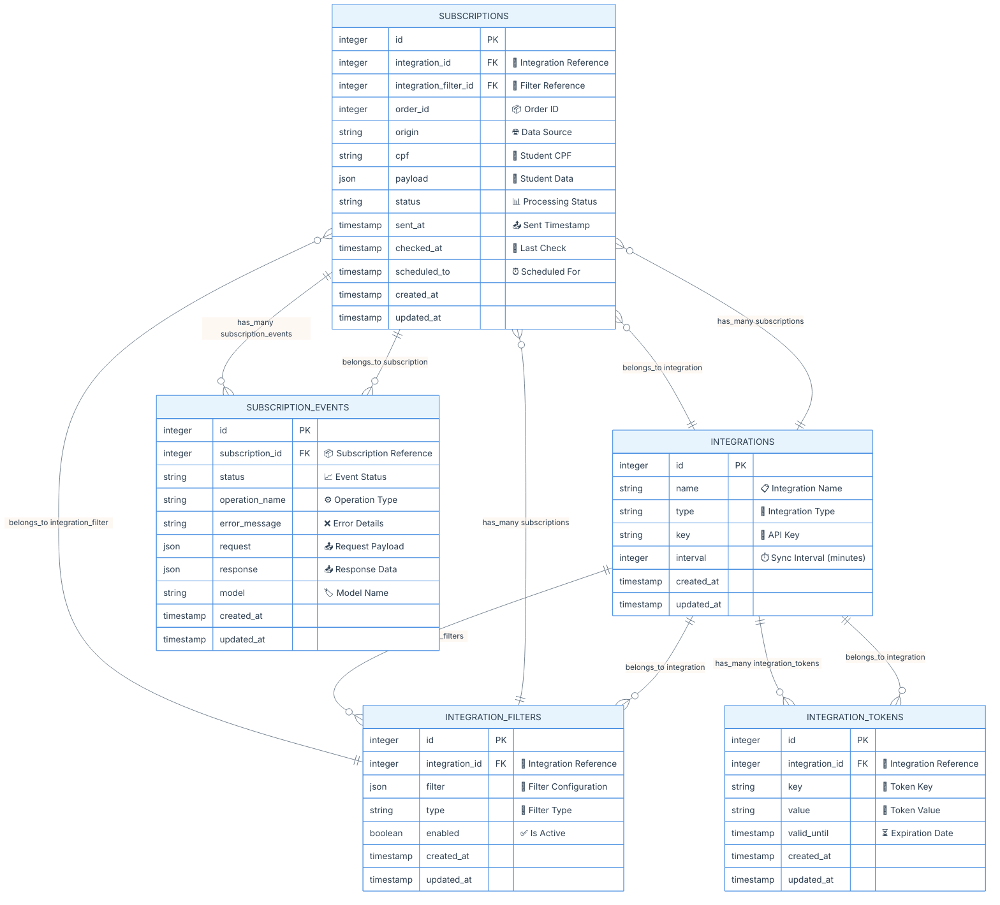
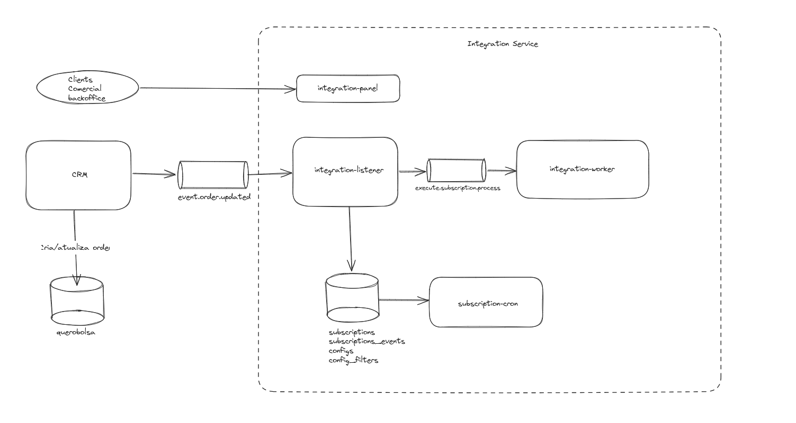
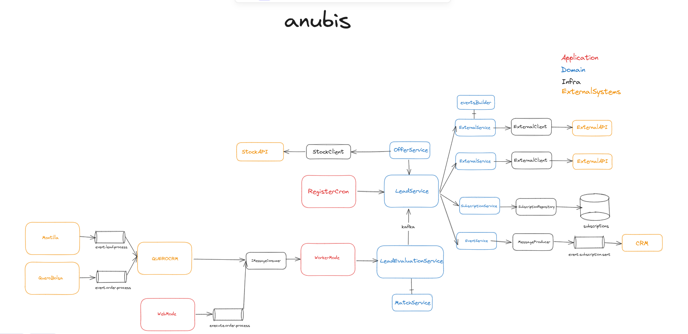
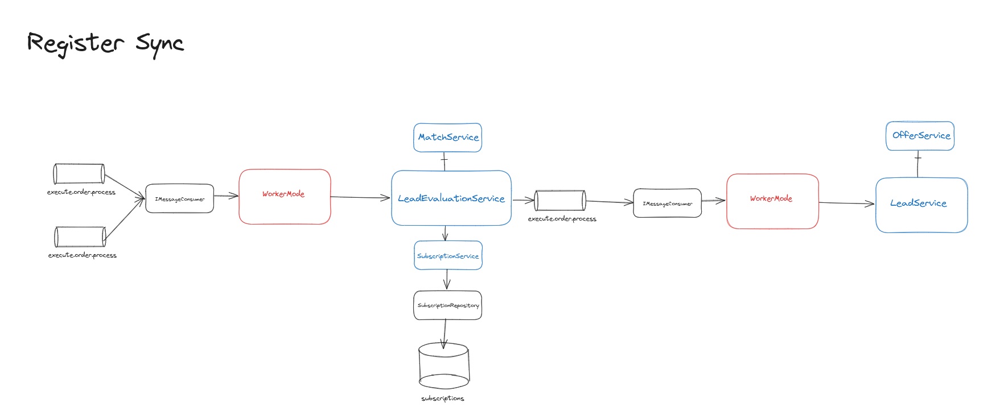
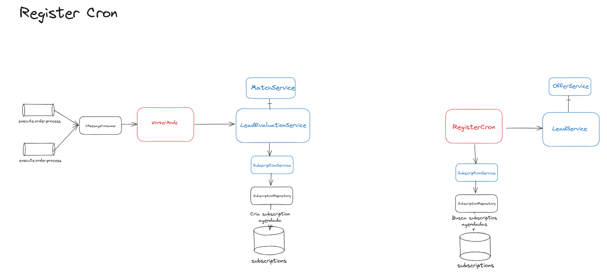
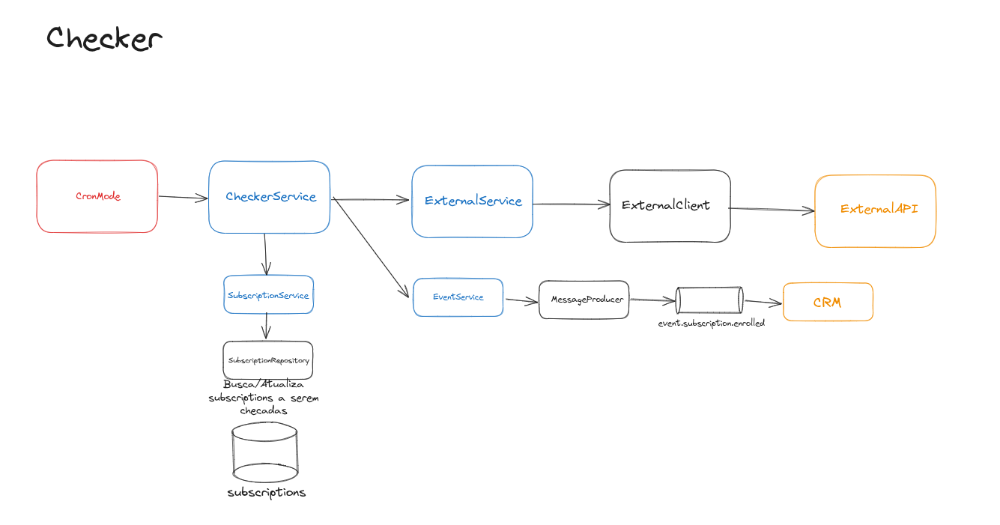

#  Anubis Projeto - Requisitos

## Descrição

O Anubis é um microserviço responsável pela orquestração do envio de dados de alunos pagantes para APIs de instituições de ensino superior, como Kroton e Estácio. Ele gerencia o fluxo de inscrições vindas do Quero Bolsa e dos novos marketplaces (Ead.com, Guia da Carreira e Mundo Vestibular), organizando os payloads e registrando logs estruturados com o status das tentativas, além de implementar mecanismos automáticos de retry para falhas temporárias.

O escopo do serviço não inclui o envio de leads do Quero Captação, alunos pagantes de outros produtos da Qeevo, agendamento de envios ou interface para reenvio manual de falhas. O foco está na integração eficiente e segura dos dados de alunos pagantes entre os sistemas internos e as APIs das instituições parceiras.

## Modelo de Dados (ER Diagram)

📊 Diagrama Entidade-Relacionamento

### 🛡️ Considerações de Segurança

**Segurança:**
- CPF deve ser não precisa ser hasheado/criptografado em produção
- Tokens não devem ser armazenados com criptografia

## Fluxos do Projeto

**📋 Explicação da Visão Geral:**

### 🔧 Arquitetura de Serviços

**⚙️ Explicação da Arquitetura de Serviços:**

#### 📋 Fluxo Register Sync

**🔄 Explicação do Register Sync:**

#### ⏰ Fluxo Register Cron

**⏰ Explicação do Register Cron:**

#### 🔍 Fluxo Checker

**🔍 Explicação do Fluxo Checker:**
