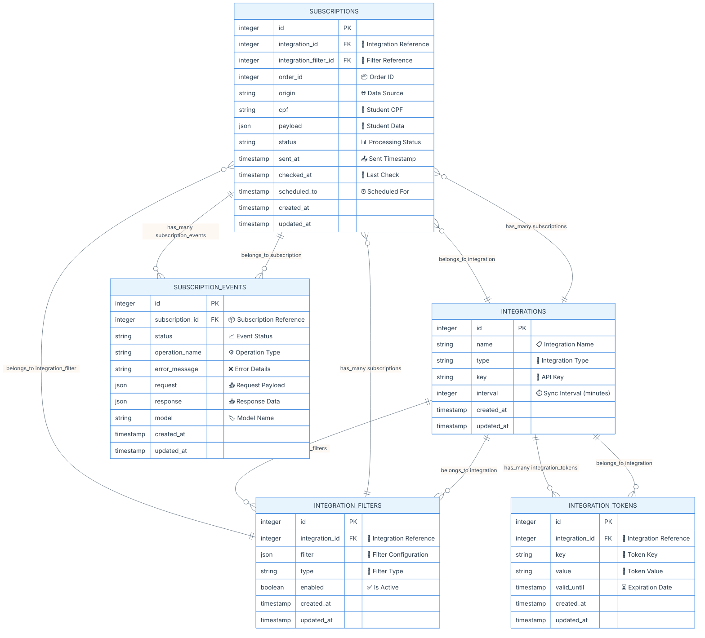
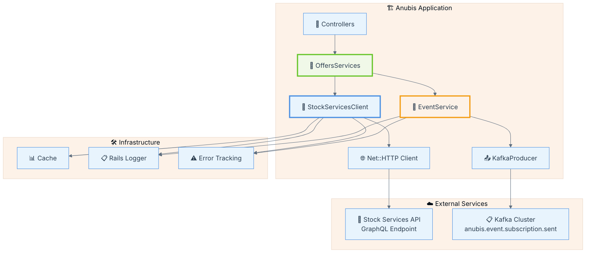
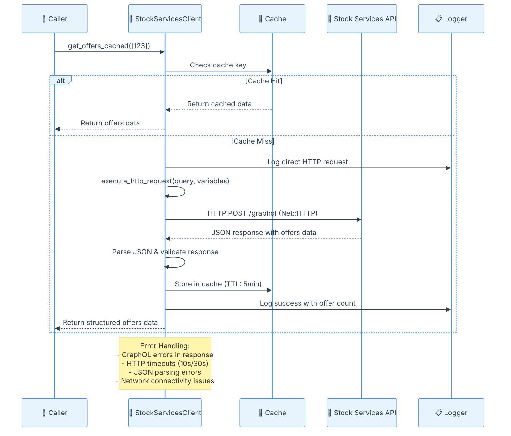
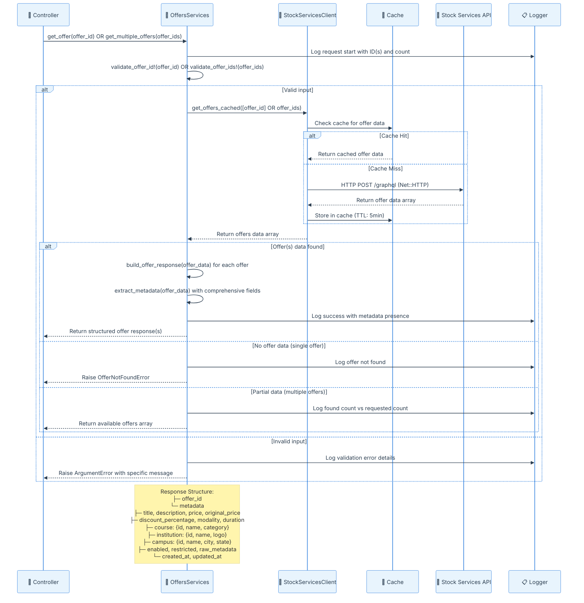
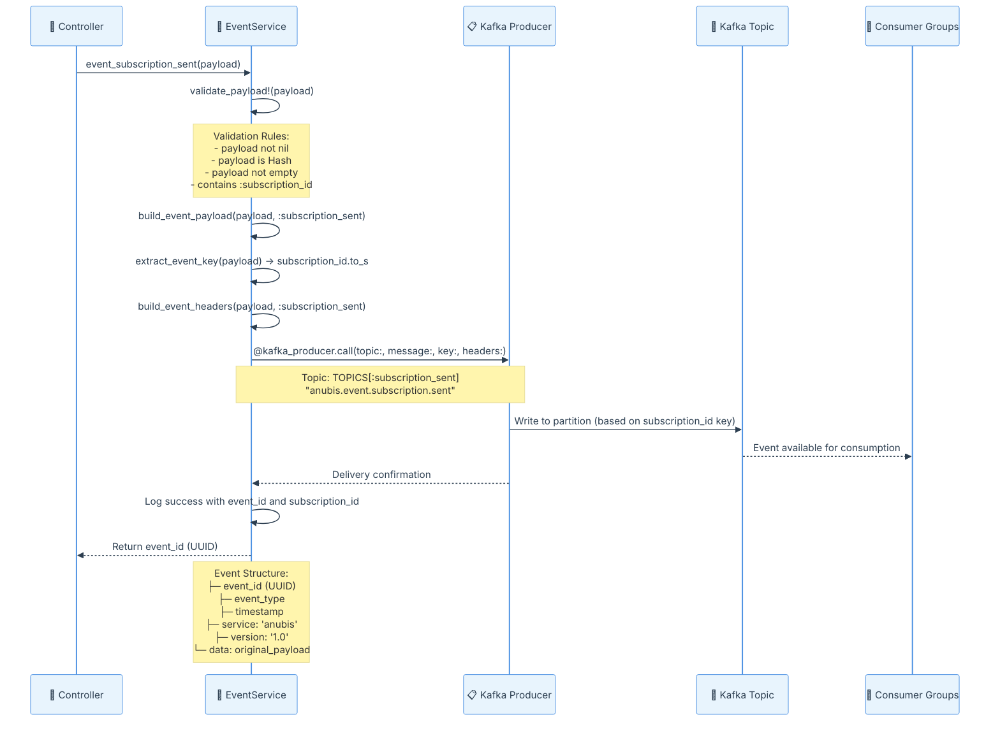

#  Anubis Projeto - Requisitos

## Descrição

O Anubis é um microserviço responsável pela orquestração do envio de dados de alunos pagantes para APIs de instituições de ensino superior, como Kroton e Estácio. Ele gerencia o fluxo de inscrições vindas do Quero Bolsa e dos novos marketplaces (Ead.com, Guia da Carreira e Mundo Vestibular), organizando os payloads e registrando logs estruturados com o status das tentativas, além de implementar mecanismos automáticos de retry para falhas temporárias.

O escopo do serviço não inclui o envio de leads do Quero Captação, alunos pagantes de outros produtos da Qeevo, agendamento de envios ou interface para reenvio manual de falhas. O foco está na integração eficiente e segura dos dados de alunos pagantes entre os sistemas internos e das APIs das instituições parceiras.

**Tecnologias predominantes**

```mermaid
%%{init: {
  'theme':'base',
  'themeVariables': {
    'primaryColor':'#E8F4FD',
    'primaryBorderColor':'#4A90E2',
    'primaryTextColor':'#2C3E50',
    'secondaryColor':'#F0F8E8',
    'tertiaryColor':'#FDF2E8',
    'quaternaryColor':'#F8E8F8',
    'lineColor':'#5D6D7E',
    'fontFamily':'Inter,Segoe UI,Arial'
  }
}}%%
graph TB
    subgraph "💎 Core Technologies"
        RUBY[💎 Ruby 3.4.5<br/>Language Runtime]
        RAILS[🚂 Rails 8.0.3<br/>Web Framework]
        PG[🐘 PostgreSQL 17<br/>Database]
    end
    
    subgraph "🔌 API & Integration"
        HTTP[🌐 Net::HTTP<br/>Ruby Standard Library]
        JSON[📋 JSON Parser<br/>Built-in Ruby JSON]
        OJ[⚡ OJ 3.15.0<br/>Fast JSON Parser]
    end
    
    subgraph "📨 Event Streaming"
        KAFKA[📋 Kafka<br/>Event Streaming]
        RDKAFKA[🚀 RDKafka 0.23.1<br/>Kafka Client]
        RACECAR[🏎️ Racecar 2.12<br/>Kafka Consumer]
    end
    
    subgraph "🧪 Testing & Quality"
        RSPEC[🧪 RSpec Rails 8.0<br/>Testing Framework]
        SIMPLECOV[📊 SimpleCov 0.22.0<br/>Code Coverage]
        FACTORY[🏭 FactoryBot Rails 6.5<br/>Test Data]
        FAKER[🎭 Faker 3.5<br/>Fake Data Generator]
        SHOULDA[✅ Shoulda Matchers 6.5<br/>Test Matchers]
        BRAKEMAN[🛡️ Brakeman<br/>Security Scanner]
        RUBOCOP[🎨 RuboCop Omakase<br/>Code Style]
    end
    
    subgraph "⚙️ State & Workflow"
        AASM[🎯 AASM 5.5<br/>State Machine]
    end
    
    subgraph "🛠️ Development Tools"
        TIDEWAVE[🌊 Tidewave 0.3.1<br/>Development Helpers]
    end
    
    %% Core Dependencies
    RUBY --> RAILS
    RAILS --> PG
    
    %% API Integration Flow
    RAILS --> HTTP
    HTTP --> JSON
    JSON --> OJ
    
    %% Event Streaming Flow
    RAILS --> RDKAFKA
    RDKAFKA --> KAFKA
    RDKAFKA --> RACECAR
    
    %% Testing Dependencies
    RAILS --> RSPEC
    RSPEC --> FACTORY
    RSPEC --> FAKER
    RSPEC --> SHOULDA
    RSPEC --> SIMPLECOV
    
    %% State Management
    RAILS --> AASM
    
    %% Development Tools
    RAILS --> TIDEWAVE
    
    %% Quality Tools
    RAILS --> BRAKEMAN
    RAILS --> RUBOCOP
    
    %% Styling
    classDef coreStyle fill:#E8F4FD,stroke:#4A90E2,stroke-width:3px
    classDef apiStyle fill:#F0F8E8,stroke:#67C52A,stroke-width:2px
    classDef eventStyle fill:#FDF2E8,stroke:#F39C12,stroke-width:2px
    classDef testStyle fill:#F8E8F8,stroke:#9B59B6,stroke-width:2px
    classDef stateStyle fill:#E8F6F3,stroke:#1ABC9C,stroke-width:2px
    classDef devStyle fill:#FEF9E7,stroke:#F1C40F,stroke-width:2px
    classDef frontendStyle fill:#FADBD8,stroke:#E74C3C,stroke-width:2px
    classDef infraStyle fill:#EBF5FB,stroke:#3498DB,stroke-width:2px
    
    class RUBY,RAILS,PG coreStyle
    class HTTP,JSON,OJ apiStyle
    class KAFKA,RDKAFKA,RACECAR eventStyle
    class RSPEC,SIMPLECOV,FACTORY,FAKER,SHOULDA,BRAKEMAN,RUBOCOP testStyle
    class AASM stateStyle
    class TIDEWAVE devStyle
```



### Entradas de Informação
- **Requisitos Base**: `#file:inputs/started-requirements.md`. 
- **Epico**: `#file:inputs/epico.md` 
- **Base de código atual**: `#folder:inputs/repositories/anubis`.
- **Arquitetura similar e exemplos de Integração**:
  - Arquitetura similar: `#folder:inputs/repositories/quero-deals`
  - Exemplo de integração: `#folder:inputs/repositories/estacio-lead-integration`
  - Exemplo de integração: `#folder:inputs/repositories/kroton-lead-integration`


## Modelo de Dados (ER Diagram)

📊 Diagrama Entidade-Relacionamento

<details>
<summary>📊 ER Diagram - Database Schema & Relationships</summary>



</details>

### 🛡️ Considerações de Segurança

**Segurança:**
- CPF deve ser não precisa ser hasheado/criptografado em produção
- Tokens não devem ser armazenados com criptografia


## Arquitetura do Projeto


**📋 Explicação da Arquitetura**


### 🔧 Arquitetura de Serviços




## 📚 Explicação da Arquitetura de Serviços

### 🎯 **Visão Geral da Arquitetura**

A arquitetura dos serviços segue o padrão de **3 camadas (3-Tier Architecture)** com responsabilidades bem definidas:

1. **📱 Presentation Layer**: Controllers que recebem requisições HTTP
2. **🎪 Business Logic Layer**: Serviços que implementam a lógica de negócio
3. **🔌 Data Access Layer**: Clientes que fazem interface com APIs externas

### 🔍 **Análise Detalhada por Serviço**

#### 1. 🔌 **StockServicesClient - Data Access Layer**

**Responsabilidades:**
- **🎯 Propósito**: Cliente HTTP direto para comunicação GraphQL com a API stock-services
- **🔧 Padrão**: Singleton para reutilização de configurações
- **💾 Cache**: Implementa cache Rails para otimização de performance
- **🛡️ Resiliência**: Tratamento robusto de erros e timeouts configuráveis

**Fluxo de Dados:**

<details>
<summary>📊 Sequence Diagram - StockServicesClient Flow</summary>



</details>

**Características Técnicas:**
- **🔄 Singleton Pattern**: Uma instância por aplicação
- **🌐 Direct HTTP**: Implementação com Net::HTTP (Ruby standard library)
- **⏱️ Timeout Configuration**: Controle granular de timeouts (open: 10s, read: 30s)
- **🔐 Security Headers**: User-Agent e headers de proteção CSRF
- **📊 Monitoring**: Logs estruturados para observabilidade
- **🌍 Environment-aware**: URLs dinâmicas baseadas no ambiente Rails

#### 2. 🎪 **OffersServices - Business Logic Layer**

**Responsabilidades:**
- **🎯 Propósito**: Orquestração da lógica de negócio para ofertas (single e batch)
- **🔧 Padrão**: Service Object com injeção de dependência testável
- **✅ Validação**: Validação rigorosa de entrada e regras de negócio (max 100 IDs)
- **🏗️ Transformação**: Formatação estruturada e enriquecimento de metadados
- **📊 Batch Processing**: Suporte a processamento em lote de ofertas

**Interface Pública:**
```ruby
# Busca uma oferta individual
get_offer(offer_id) -> Hash

# Busca múltiplas ofertas (até 100)
get_multiple_offers(offer_ids) -> Array[Hash]
```

**Fluxo de Processamento:**

<details>
<summary>📊 Sequence Diagram - OffersServices Processing Flow</summary>



</details>

**Características Técnicas:**
- **🔧 Dependency Injection**: StockServicesClient injetado para testabilidade completa
- **📊 Rich Data Transformation**: Estruturação abrangente com 15+ campos de metadados
- **🛡️ Comprehensive Validation**: Validação multi-nível (nil, empty, numeric, batch limits)
- **📋 Intelligent Error Handling**: 4 tipos de exceções (ArgumentError, OfferNotFoundError, StockServicesError, OffersServiceError)
- **📦 Batch Processing**: Suporte a até 100 ofertas por requisição
- **📊 Structured Logging**: Logs detalhados com emojis e contexto completo

#### 3. 📨 **EventService - Business Logic Layer**

**Responsabilidades:**
- **🎯 Propósito**: Publicação de eventos para sistemas externos via Kafka
- **🔧 Padrão**: Service Object com injeção de dependência testável
- **📋 Estruturação**: Padronização de formato de eventos com versionamento
- **🔑 Partitioning**: Estratégia de chaveamento por `subscription_id`
- **🎪 Topic Management**: Gestão centralizada de tópicos Kafka
- **✅ Payload Validation**: Validação rigorosa de estrutura e campos obrigatórios

**Interface Pública:**
```ruby
# Publica evento de inscrição enviada
event_subscription_sent(payload) -> String (event_id)

# Futuro: evento de inscrição com falha
event_subscription_failed(payload) -> String (event_id)
```

**Tópicos Kafka:**
```ruby
TOPICS = {
  subscription_sent: "anubis.event.subscription.sent"
}.freeze
```

**Fluxo de Eventos:**

<details>
<summary>📊 Sequence Diagram - EventService Flow</summary>



</details>

**Características Técnicas:**
- **🔑 Event Sourcing**: Padrão de eventos imutáveis com UUID
- **📋 Schema Evolution**: Versionamento de eventos ("1.0") e estrutura padronizada
- **🎯 Partitioning Strategy**: Chaveamento por `subscription_id.to_s`
- **🛡️ Error Handling**: 2 níveis (ArgumentError re-raise, outros wrapping em EventServiceError)
- **📊 Topic Management**: Constantes centralizadas (TOPICS hash)
- **🔧 Dependency Injection**: Kafka::ProducerService injetável para testes
- **✅ Comprehensive Validation**: 4 níveis de validação de payload
- **📈 Enhanced Headers**: Headers estruturados com metadados do evento

### 🔄 **Padrões Arquiteturais Implementados**

#### 1. **🏗️ Layered Architecture (Arquitetura em Camadas)**
- **Presentation**: Controllers HTTP
- **Business Logic**: Services (OffersServices, EventService)
- **Data Access**: Clients (StockServicesClient)

#### 2. **🔧 Dependency Injection**
```ruby
# Permite fácil substituição para testes
offers_service = OffersServices.new(stock_client: mock_client)
event_service = EventService.new(kafka_producer: mock_kafka_producer)

# Exemplo de uso em produção
offers_service = OffersServices.new  # usa StockServicesClient.instance por padrão
event_service = EventService.new     # usa Kafka::ProducerService por padrão

# Uso dos serviços
single_offer = offers_service.get_offer(123)
batch_offers = offers_service.get_multiple_offers([123, 456, 789])
event_id = event_service.event_subscription_sent({ subscription_id: 123, status: 'sent' })
```

#### 3. **⏱️ Timeout Management Pattern**
```ruby
# Controle granular de timeouts para resiliência
http.open_timeout = 10    # Connection timeout
http.read_timeout = 30    # Read timeout
```

#### 4. **💾 Cache-Aside Pattern**
```ruby
# Cache inteligente com TTL
Rails.cache.fetch(cache_key, expires_in: 5.minutes) do
  expensive_api_call
end
```

#### 5. **📋 Publisher-Subscriber Pattern**
```ruby
# Publicação assíncrona de eventos com estrutura padronizada
@kafka_producer.call(
  topic: TOPICS[:subscription_sent],
  message: {
    event_id: SecureRandom.uuid,
    event_type: "subscription_sent",
    timestamp: Time.current.iso8601,
    service: "anubis",
    version: "1.0",
    data: payload
  },
  key: payload[:subscription_id].to_s,
  headers: { "event_type" => "subscription_sent", "service" => "anubis" }
)
```

### 🎯 **Benefícios da Arquitetura**

1. **🔧 Separation of Concerns**: Cada camada tem responsabilidade específica
2. **🧪 Testability**: Injeção de dependência facilita testes unitários
3. **📈 Scalability**: Serviços podem ser escalados independentemente
4. **🛡️ Reliability**: Múltiplas camadas de tratamento de erro
5. **📊 Observability**: Logging estruturado em todas as camadas
6. **🔄 Maintainability**: Código organizado e padrões consistentes
7. **⚡ Performance**: Cache inteligente e connection pooling

---

## 📚 Referências

Esta seção contém links para documentações técnicas detalhadas e guias de implementação relacionados ao projeto Anubis:

### 🔧 **Documentação Técnica**

- **[📊 Kafka Implementation Guide](../docs/kafka-implementation-guide.md)** - Guia completo de implementação Kafka
- **[🌐 Quero Deals](../docs/quero-deals.md)** - Documentação do sistema Quero Deals

### 💻 **Base do Código Existente**

- **[🔗 Projeto Anubis - GitHub](https://github.com/quero-edu/anubis)** - Repositório oficial do microserviço Anubis com estrutura Rails completa

### 🏢 **Integrações com Instituições**

- **[🎓 Estácio Lead Integration](../docs/estacio-lead-integration.md)** - Guia de integração com API da Estácio
- **[🎓 Kroton Lead Integration](../docs/kroton-lead-integration.md)** - Guia de integração com API da Kroton

### 📖 **Como Usar as Referências**

Estas documentações fornecem:

- **🔍 Detalhes de Implementação**: Especificações técnicas e exemplos de código
- **🔧 Guias de Configuração**: Configurações necessárias para cada integração
- **📊 Diagramas e Fluxos**: Visualizações detalhadas dos processos
- **🛡️ Tratamento de Erros**: Estratégias de resiliência e recuperação
- **🧪 Exemplos de Teste**: Cenários de teste e validação

> **💡 Dica**: Use estas referências como complemento a este documento principal para obter informações mais específicas sobre implementações e integrações.