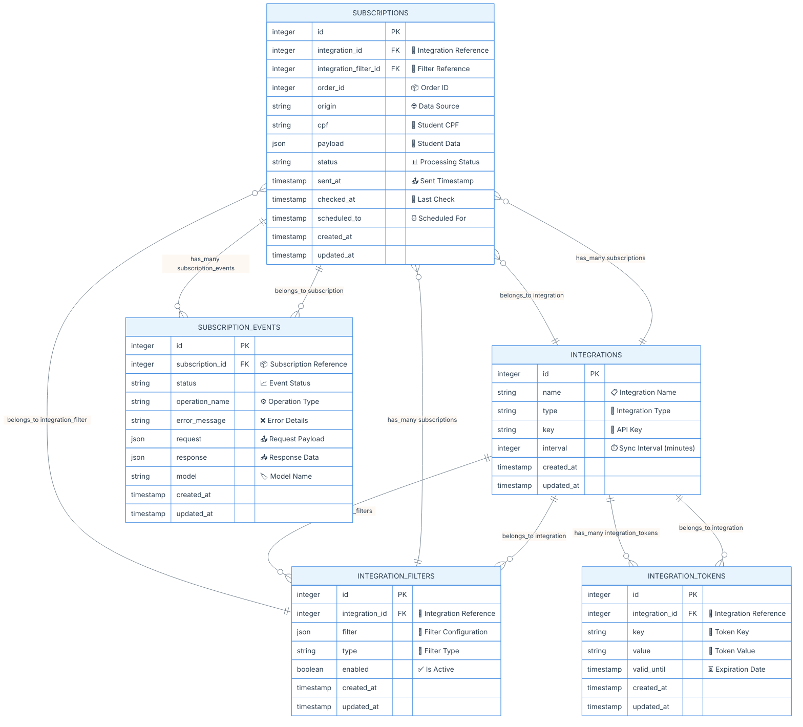
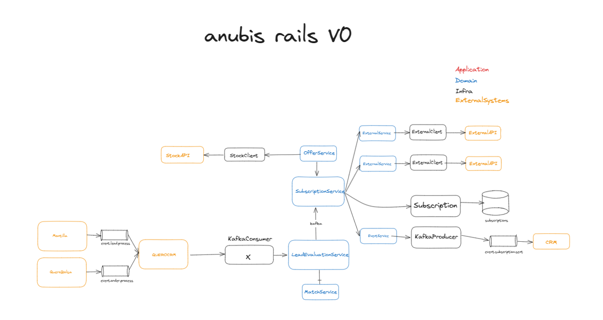
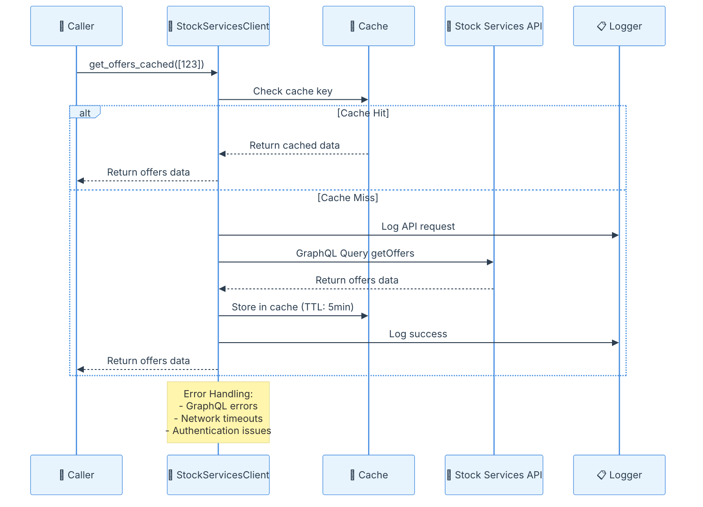
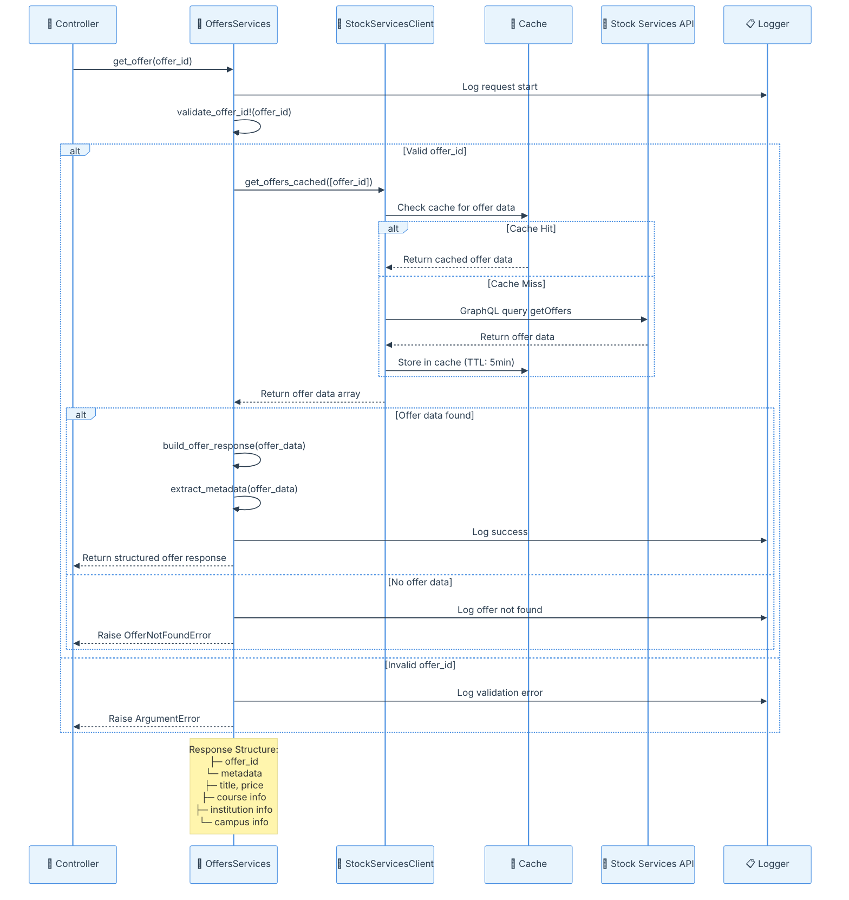
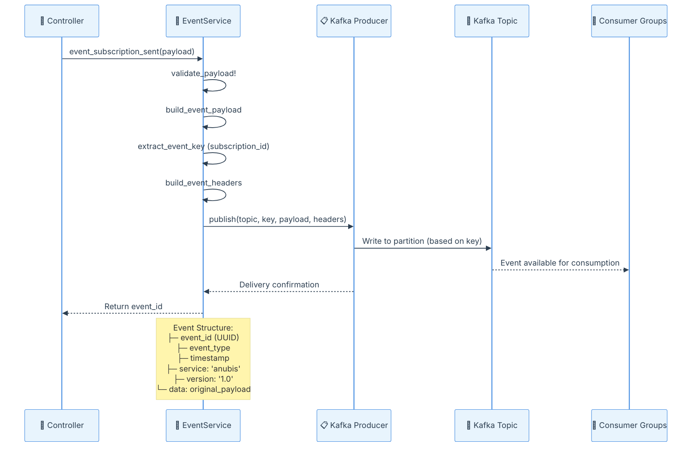

#  Anubis Projeto - Requisitos

## Descrição

O Anubis é um microserviço responsável pela orquestração do envio de dados de alunos pagantes para APIs de instituições de ensino superior, como Kroton e Estácio. Ele gerencia o fluxo de inscrições vindas do Quero Bolsa e dos novos marketplaces (Ead.com, Guia da Carreira e Mundo Vestibular), organizando os payloads e registrando logs estruturados com o status das tentativas, além de implementar mecanismos automáticos de retry para falhas temporárias.

O escopo do serviço não inclui o envio de leads do Quero Captação, alunos pagantes de outros produtos da Qeevo, agendamento de envios ou interface para reenvio manual de falhas. O foco está na integração eficiente e segura dos dados de alunos pagantes entre os sistemas internos e as APIs das instituições parceiras.

**Tecnologias predominantes:**
- Ruby 3.4.5
- Rails 8.0.3
- Postgres 17
- Kafka
- Rspec
- Simplecov
- AASM
- Tidewave

### Input Sources
- **Base Requirements**: `#file:inputs/started-requirements.md` (Contains description, ER diagrams, and sketched architecture). This is the document to be used as starting point.
- **Epic Documentation**: `#file:inputs/epico.md` (High-level project epic and goals)
- **Existing Codebase**: `#folder:inputs/repositories/anubis` (Starting point for Rails application structure). This repository  contains all the required Gems already installed and configured. Inclusive the database models for PostgreSQL.
- **Reference Architectures**:
  - Similar microservice pattern and stack: `#folder:inputs/repositories/quero-deals`
  - Integration examples: `#folder:inputs/repositories/estacio-lead-integration`
  - Integration examples: `#folder:inputs/repositories/kroton-lead-integration`


## Modelo de Dados (ER Diagram)

📊 Diagrama Entidade-Relacionamento



### 🛡️ Considerações de Segurança

**Segurança:**
- CPF deve ser não precisa ser hasheado/criptografado em produção
- Tokens não devem ser armazenados com criptografia


## Arquitetura do Projeto



**📋 Explicação da Arquitetura**


### 🔧 Arquitetura de Serviços


## 📚 Explicação da Arquitetura de Serviços

### 🎯 **Visão Geral da Arquitetura**

A arquitetura dos serviços segue o padrão de **3 camadas (3-Tier Architecture)** com responsabilidades bem definidas:

1. **📱 Presentation Layer**: Controllers que recebem requisições HTTP
2. **🎪 Business Logic Layer**: Serviços que implementam a lógica de negócio
3. **🔌 Data Access Layer**: Clientes que fazem interface com APIs externas

### 🔍 **Análise Detalhada por Serviço**

#### 1. 🔌 **StockServicesClient - Data Access Layer**

**Responsabilidades:**
- **🎯 Propósito**: Cliente GraphQL para comunicação com a API stock-services
- **🔧 Padrão**: Singleton para reutilização de conexões
- **💾 Cache**: Implementa cache Redis para otimização de performance
- **🛡️ Resiliência**: Retry automático e tratamento de erros

**Fluxo de Dados:**

<details>
<summary>📊 Sequence Diagram - StockServicesClient Flow</summary>



</details>

**Características Técnicas:**
- **🔄 Singleton Pattern**: Uma instância por aplicação
- **⚡ Connection Pooling**: Reutilização de conexões HTTP
- **🛡️ Circuit Breaker**: Proteção contra falhas em cascata
- **📊 Monitoring**: Logs estruturados para observabilidade

#### 2. 🎪 **OffersServices - Business Logic Layer**

**Responsabilidades:**
- **🎯 Propósito**: Orquestração da lógica de negócio para ofertas
- **🔧 Padrão**: Service Object com injeção de dependência
- **✅ Validação**: Validação de entrada e regras de negócio
- **🏗️ Transformação**: Formatação de dados para consumo

**Fluxo de Processamento:**

<details>
<summary>📊 Sequence Diagram - OffersServices Processing Flow</summary>



</details>

**Características Técnicas:**
- **🔧 Dependency Injection**: StockServicesClient injetado para testabilidade
- **📊 Data Transformation**: Estruturação consistente de dados
- **🛡️ Input Validation**: Validação rigorosa de parâmetros
- **📋 Error Propagation**: Propagação inteligente de erros

#### 3. 📨 **EventService - Business Logic Layer**

**Responsabilidades:**
- **🎯 Propósito**: Publicação de eventos para sistemas externos via Kafka
- **🔧 Padrão**: Service Object com publisher pattern
- **📋 Estruturação**: Padronização de formato de eventos
- **🔑 Partitioning**: Estratégia de chaveamento para Kafka

**Fluxo de Eventos:**

<details>
<summary>📊 Sequence Diagram - EventService Flow</summary>



</details>

**Características Técnicas:**
- **🔑 Event Sourcing**: Padrão de eventos imutáveis
- **📋 Schema Evolution**: Versionamento de eventos
- **🎯 Partitioning Strategy**: Chaveamento por subscription_id
- **🛡️ At-Least-Once Delivery**: Garantia de entrega

### 🔄 **Padrões Arquiteturais Implementados**

#### 1. **🏗️ Layered Architecture (Arquitetura em Camadas)**
- **Presentation**: Controllers HTTP
- **Business Logic**: Services (OffersServices, EventService)
- **Data Access**: Clients (StockServicesClient)

#### 2. **🔧 Dependency Injection**
```ruby
# Permite fácil substituição para testes
OffersServices.new(stock_client: mock_client)
EventService.new(kafka_producer: mock_producer)
```

#### 3. **🛡️ Circuit Breaker Pattern**
```ruby
# Proteção contra falhas em cascata
conn.request :retry, 
             max: 3, 
             interval: 0.5, 
             backoff_factor: 2
```

#### 4. **💾 Cache-Aside Pattern**
```ruby
# Cache inteligente com TTL
Rails.cache.fetch(cache_key, expires_in: 5.minutes) do
  expensive_api_call
end
```

#### 5. **📋 Publisher-Subscriber Pattern**
```ruby
# Publicação assíncrona de eventos
@kafka_producer.publish(topic: topic, payload: payload)
```

### 🎯 **Benefícios da Arquitetura**

1. **🔧 Separation of Concerns**: Cada camada tem responsabilidade específica
2. **🧪 Testability**: Injeção de dependência facilita testes unitários
3. **📈 Scalability**: Serviços podem ser escalados independentemente
4. **🛡️ Reliability**: Múltiplas camadas de tratamento de erro
5. **📊 Observability**: Logging estruturado em todas as camadas
6. **🔄 Maintainability**: Código organizado e padrões consistentes
7. **⚡ Performance**: Cache inteligente e connection pooling

---

## 📚 Referências

Esta seção contém links para documentações técnicas detalhadas e guias de implementação relacionados ao projeto Anubis:

### 🔧 **Documentação Técnica**

- **[📋 Requirements](../docs/requirements.md)** - Requisitos detalhados do projeto
- **[📊 Kafka Implementation Guide](../docs/kafka-implementation-guide.md)** - Guia completo de implementação Kafka
- **[🌐 Quero Deals](../docs/quero-deals.md)** - Documentação do sistema Quero Deals

### 🏢 **Integrações com Instituições**

- **[🎓 Estácio Lead Integration](../docs/estacio-lead-integration.md)** - Guia de integração com API da Estácio
- **[🎓 Kroton Lead Integration](../docs/kroton-lead-integration.md)** - Guia de integração com API da Kroton

### 📖 **Como Usar as Referências**

Estas documentações fornecem:

- **🔍 Detalhes de Implementação**: Especificações técnicas e exemplos de código
- **🔧 Guias de Configuração**: Configurações necessárias para cada integração
- **📊 Diagramas e Fluxos**: Visualizações detalhadas dos processos
- **🛡️ Tratamento de Erros**: Estratégias de resiliência e recuperação
- **🧪 Exemplos de Teste**: Cenários de teste e validação

> **💡 Dica**: Use estas referências como complemento a este documento principal para obter informações mais específicas sobre implementações e integrações.


