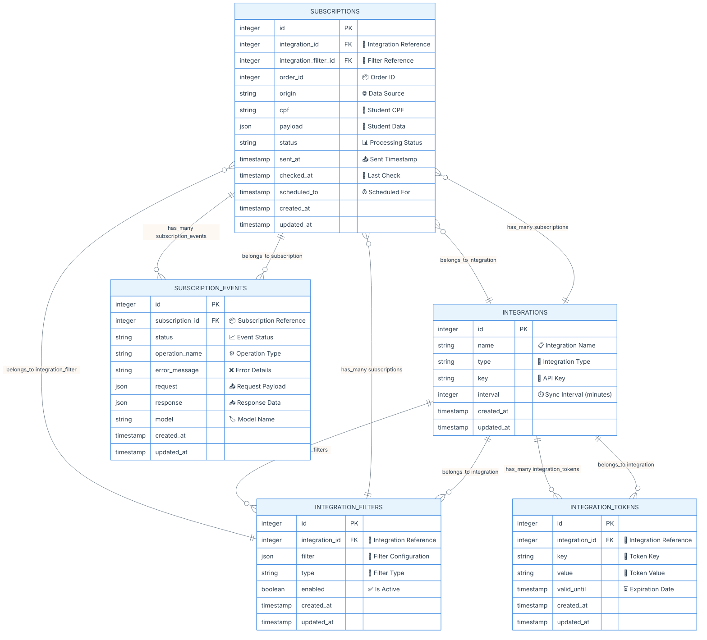
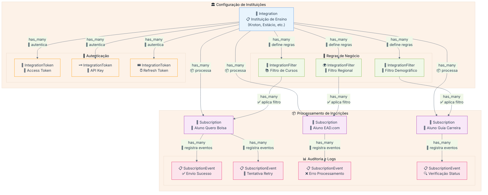

#  Anubis Projeto - Requisitos

## Descrição

O Anubis é um microserviço responsável pela orquestração do envio de dados de alunos pagantes para APIs de instituições de ensino superior, como Kroton e Estácio. Ele gerencia o fluxo de inscrições vindas do Quero Bolsa e dos novos marketplaces (Ead.com, Guia da Carreira e Mundo Vestibular), organizando os payloads e registrando logs estruturados com o status das tentativas, além de implementar mecanismos automáticos de retry para falhas temporárias.

O escopo do serviço não inclui o envio de leads do Quero Captação, alunos pagantes de outros produtos da Qeevo, agendamento de envios ou interface para reenvio manual de falhas. O foco está na integração eficiente e segura dos dados de alunos pagantes entre os sistemas internos e as APIs das instituições parceiras.

## Modelo de Dados (ER Diagram)

📊 Diagrama Entidade-Relacionamento

### 📋 Informações Relevantes do Modelo de Dados

#### 🏛️ Entidades Principais e Seus Propósitos

**🔌 Integration (Integrações)**
- **Propósito**: Representa cada API de instituição de ensino (Kroton, Estácio, etc.)
- **Campos Críticos**:
  - `name`: Nome da instituição para identificação
  - `type`: Tipo de integração (REST, SOAP, GraphQL)
  - `key`: Chave de identificação única da API
  - `interval`: Intervalo em minutos para sincronização via cron

**🎯 IntegrationFilter (Filtros de Integração)**
- **Propósito**: Define regras de negócio específicas por instituição
- **Campos Críticos**:
  - `filter`: JSON contendo regras (ex: cursos aceitos, regiões, faixa etária)
  - `type`: Tipo de filtro (course, region, demographic, etc.)
  - `enabled`: Flag para ativar/desativar filtro dinamicamente

**📦 Subscription (Inscrições)**
- **Propósito**: Representa cada inscrição de aluno a ser processada
- **Campos Críticos**:
  - `order_id`: ID do pedido no sistema origem (Quero Bolsa, etc.)
  - `origin`: Marketplace de origem (quero_bolsa, ead_com, etc.)
  - `cpf`: CPF do aluno para identificação única
  - `payload`: Dados completos do aluno em formato JSON
  - `status`: Estado atual (pending, sent, confirmed, failed)
  - Timestamps para controle de fluxo temporal

**🔐 IntegrationToken (Tokens de Autenticação)**
- **Propósito**: Gerencia tokens de acesso às APIs das instituições
- **Campos Críticos**:
  - `key`: Tipo de token (access_token, api_key, bearer, etc.)
  - `value`: Valor do token criptografado
  - `valid_until`: Data de expiração para renovação automática

**📝 SubscriptionEvent (Log de Eventos)**
- **Propósito**: Auditoria completa de todas as operações
- **Campos Críticos**:
  - `status`: Resultado da operação (success, error, retry)
  - `operation_name`: Nome da operação (register_sync, checker, cron)
  - `error_message`: Detalhes de erro para debugging
  - `request`/`response`: Payloads completos para análise

#### 🔄 Relacionamentos e Fluxo de Dados

🏗️ Hierarquia de Dependências

**Fluxo de Processamento:**
1. **Integration** define a instituição de destino
2. **IntegrationFilter** determina quais alunos são elegíveis
3. **Subscription** armazena dados do aluno para processamento
4. **IntegrationToken** fornece autenticação para API calls
5. **SubscriptionEvent** registra cada tentativa e resultado

#### 📊 Estados e Transições

**Status da Subscription:**
- `pending`: Aguardando processamento
- `filtered`: Não passou nos filtros da instituição
- `sent`: Enviado para API da instituição
- `confirmed`: Confirmado pela instituição
- `failed`: Falha no processamento
- `retry`: Agendado para nova tentativa

**Tipos de SubscriptionEvent:**
- `register_sync`: Processamento individual em tempo real
- `register_cron`: Processamento em lote via cron
- `checker`: Verificação de status na instituição
- `token_refresh`: Renovação de tokens
- `retry_attempt`: Tentativa de reenvio

#### 🛡️ Considerações de Segurança e Performance

**Segurança:**
- CPF deve ser hasheado/criptografado em produção
- Tokens devem ser armazenados com criptografia
- Payload pode conter dados sensíveis - considerar anonimização

**Performance:**
- Indexar `order_id`, `cpf`, `status` para consultas rápidas
- Particionamento de `SubscriptionEvent` por data
- Cache de `IntegrationFilter` para reduzir consultas
- Cleanup automático de eventos antigos

**Monitoramento:**
- Métricas por status de subscription
- Alertas para falhas em integrações específicas
- Dashboard de performance por instituição

## Fluxos do Projeto

**📋 Explicação da Visão Geral:**

### 🔧 Arquitetura de Serviços

**⚙️ Explicação da Arquitetura de Serviços:**

#### 📋 Fluxo Register Sync

**🔄 Explicação do Register Sync:**

#### ⏰ Fluxo Register Cron

**⏰ Explicação do Register Cron:**

#### 🔍 Fluxo Checker

**🔍 Explicação do Fluxo Checker:**
