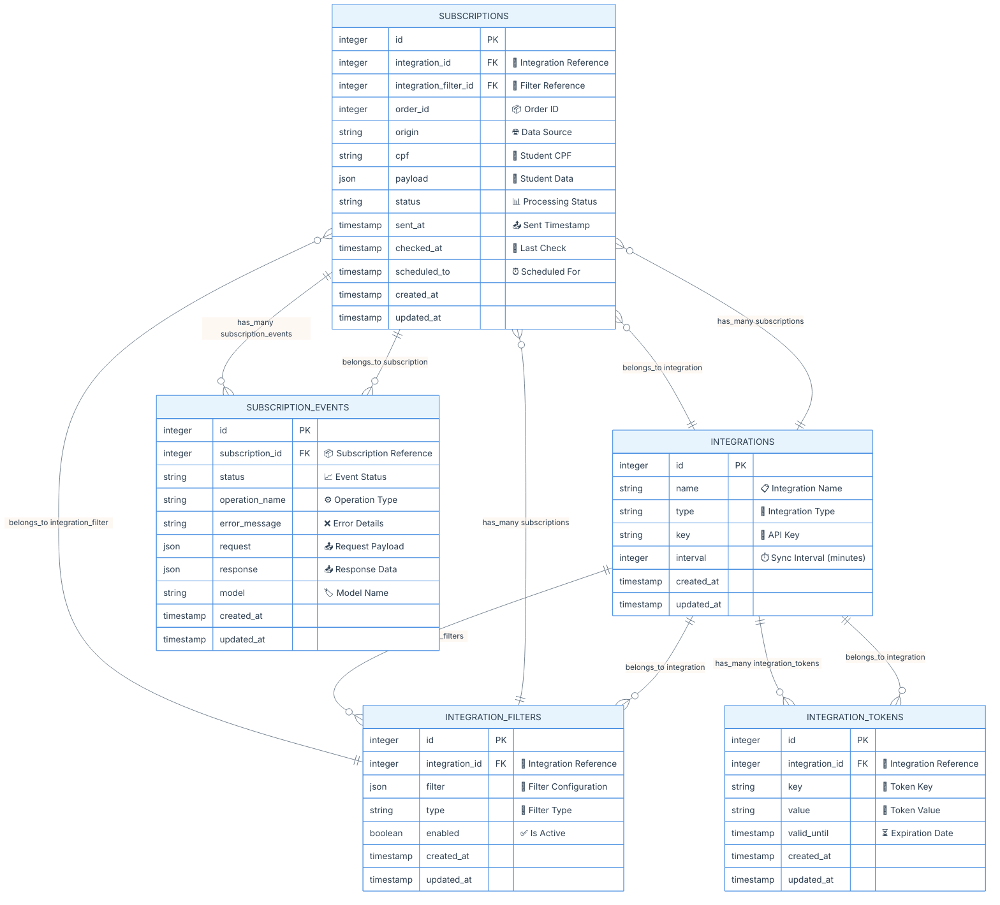
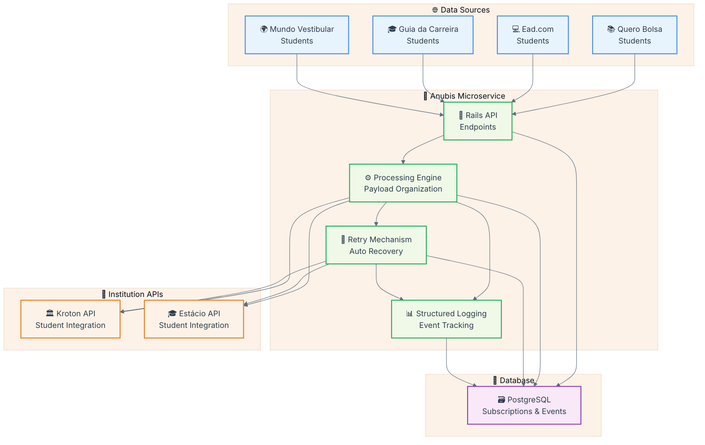
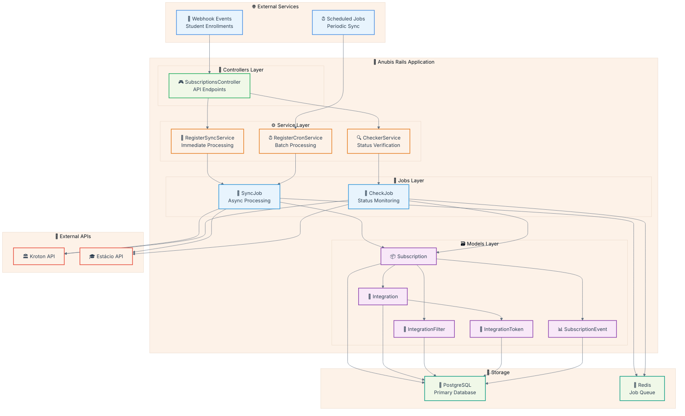
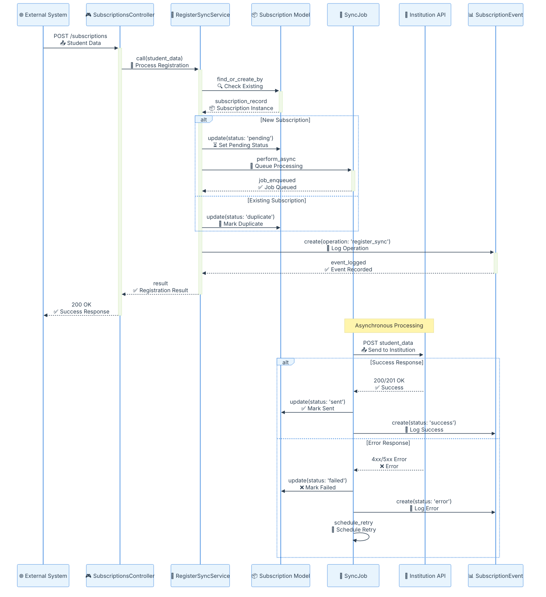
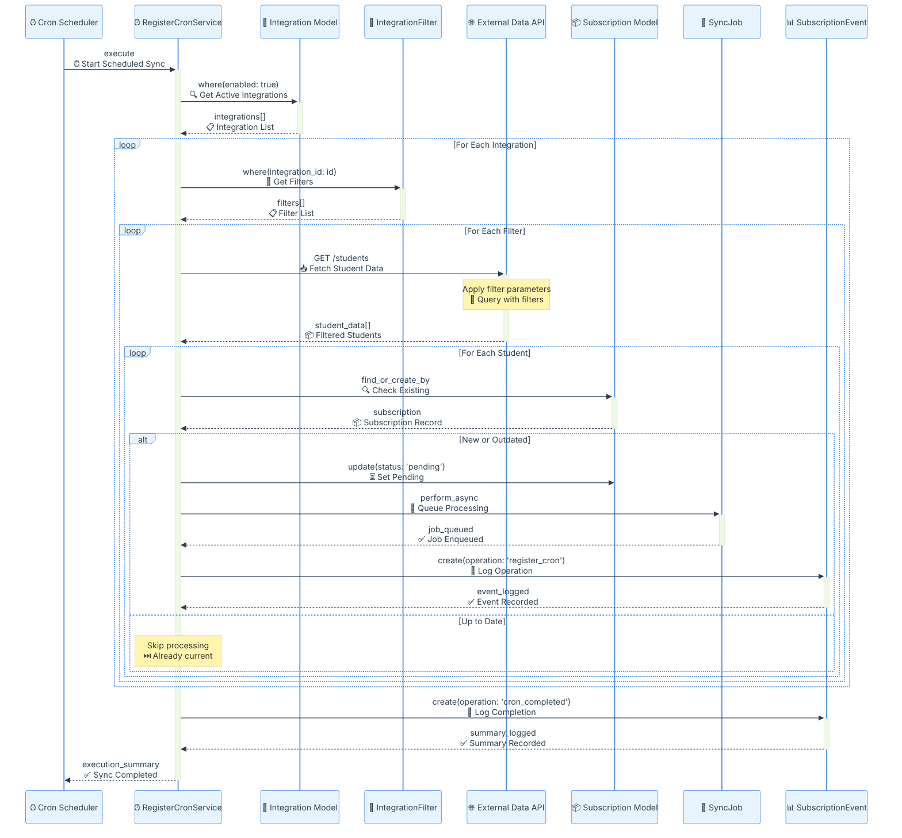
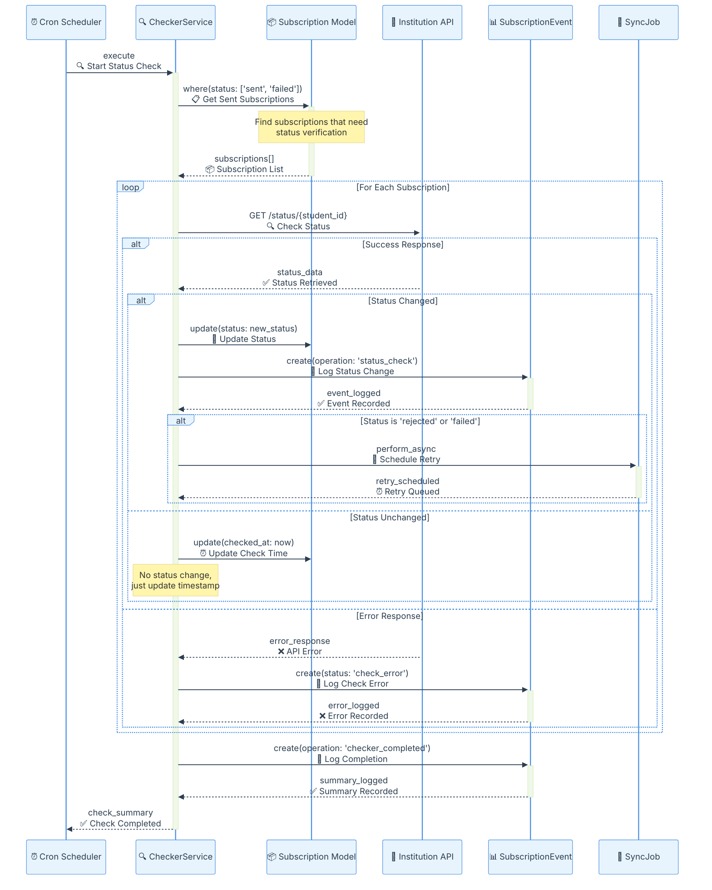

#  Anubis Projeto - Requisitos

## Descrição

O Anubis é um microserviço responsável pela orquestração do envio de dados de alunos pagantes para APIs de instituições de ensino superior, como Kroton e Estácio. Ele gerencia o fluxo de inscrições vindas do Quero Bolsa e dos novos marketplaces (Ead.com, Guia da Carreira e Mundo Vestibular), organizando os payloads e registrando logs estruturados com o status das tentativas, além de implementar mecanismos automáticos de retry para falhas temporárias.

O escopo do serviço não inclui o envio de leads do Quero Captação, alunos pagantes de outros produtos da Qeevo, agendamento de envios ou interface para reenvio manual de falhas. O foco está na integração eficiente e segura dos dados de alunos pagantes entre os sistemas internos e as APIs das instituições parceiras.

## Modelo de Dados (ER Diagram)

📊 Diagrama Entidade-Relacionamento

### 🛡️ Considerações de Segurança

**Segurança:**
- CPF deve ser não precisa ser hasheado/criptografado em produção
- Tokens não devem ser armazenados com criptografia

## Fluxos do Projeto

### 🌟 Visão Geral do Sistema Anubis

**📋 Explicação da Visão Geral:**
O sistema Anubis atua como um orquestrador central que recebe dados de alunos pagantes de múltiplas fontes (Quero Bolsa e novos marketplaces), processa e organiza os payloads, implementa mecanismos de retry para falhas temporárias, e envia os dados para as APIs das instituições de ensino superior. Todo o processo é registrado com logs estruturados para rastreabilidade completa.

### 🔧 Arquitetura de Serviços

**⚙️ Explicação da Arquitetura de Serviços:**
A arquitetura do Anubis segue os padrões Rails com separação clara de responsabilidades. Os webhooks e jobs agendados alimentam o sistema através de controllers, que delegam para services específicos. Os jobs assíncronos processam as integrações, enquanto os models gerenciam a persistência no PostgreSQL e o Redis gerencia a fila de jobs.

#### 📋 Fluxo Register Sync

**🔄 Explicação do Register Sync:**
O fluxo Register Sync processa registros de alunos em tempo real. Quando um sistema externo envia dados de um aluno, o controller recebe a requisição e delega para o RegisterSyncService, que verifica se já existe uma subscription para aquele aluno. Se for nova, agenda um job assíncrono para enviar os dados para a API da instituição. Todo o processo é logado para rastreabilidade.

#### ⏰ Fluxo Register Cron

**⏰ Explicação do Register Cron:**
O fluxo Register Cron executa sincronizações programadas em lote. O scheduler ativa o RegisterCronService, que busca todas as integrações ativas e seus filtros. Para cada combinação, faz requisições para APIs externas buscando dados de alunos que atendem aos critérios dos filtros. Novos registros ou atualizações são enfileirados para processamento assíncrono.

#### 🔍 Fluxo Checker

**🔍 Explicação do Fluxo Checker:**
O fluxo Checker verifica periodicamente o status das subscriptions que foram enviadas para as instituições. O CheckerService busca todas as subscriptions com status 'sent' ou 'failed' e consulta a API da instituição para verificar se houve mudanças no status. Se o status mudou, atualiza o registro e registra o evento. Em caso de rejeição ou falha, agenda um novo retry automaticamente.
