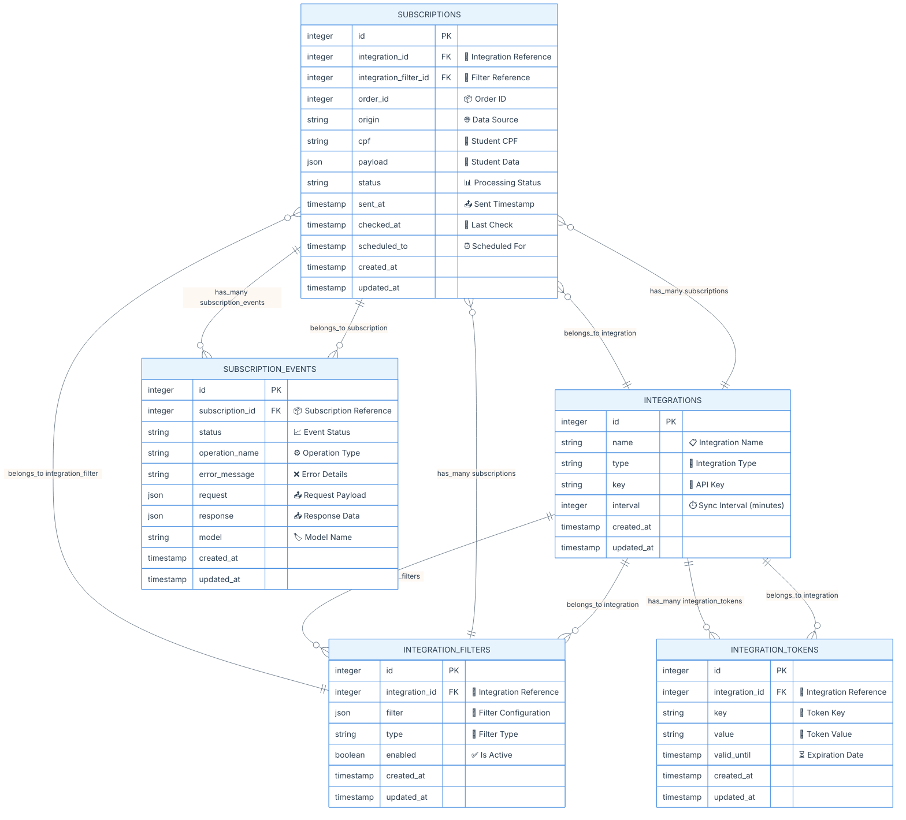
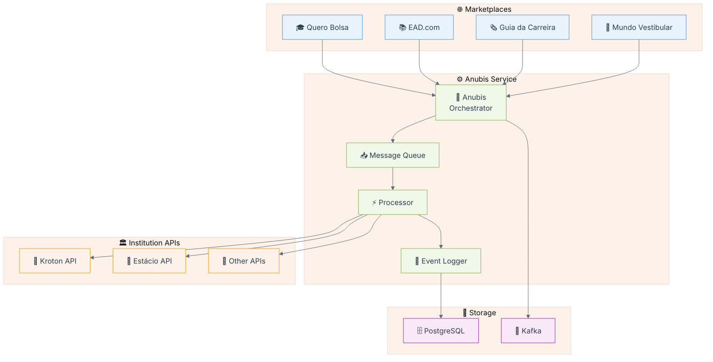
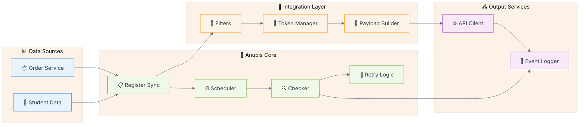
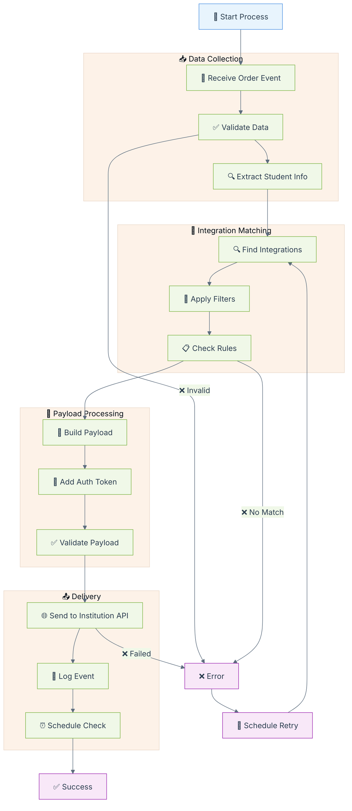
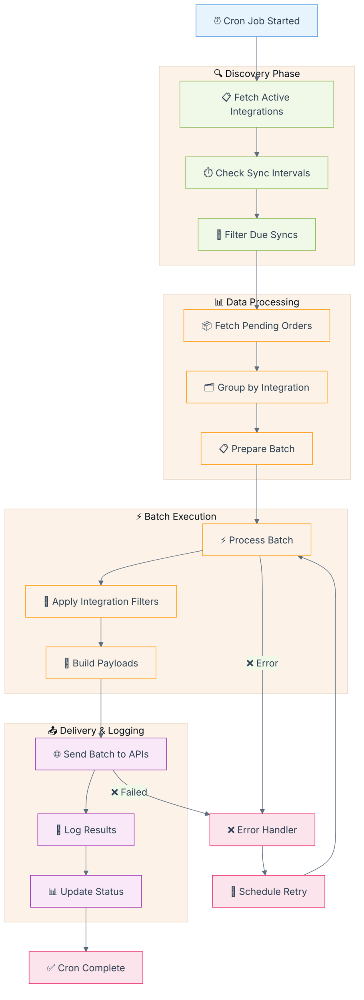
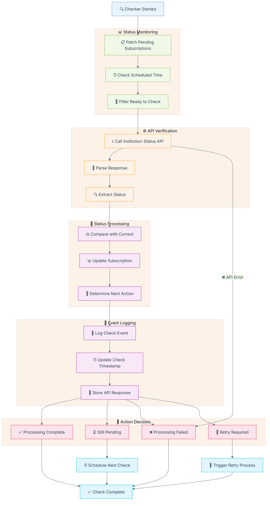

# Anubis

## Descrição

O Anubis é um microserviço responsável pela orquestração do envio de dados de alunos pagantes para APIs de instituições de ensino superior, como Kroton e Estácio. Ele gerencia o fluxo de inscrições vindas do Quero Bolsa e dos novos marketplaces (Ead.com, Guia da Carreira e Mundo Vestibular), organizando os payloads e registrando logs estruturados com o status das tentativas, além de implementar mecanismos automáticos de retry para falhas temporárias.

O escopo do serviço não inclui o envio de leads do Quero Captação, alunos pagantes de outros produtos da Qeevo, agendamento de envios ou interface para reenvio manual de falhas. O foco está na integração eficiente e segura dos dados de alunos pagantes entre os sistemas internos e as APIs das instituições parceiras.


## Modelo de Dados (ER Diagram)

<details>
<summary>📊 Visualizar Diagrama Entidade-Relacionamento</summary>



</details>

### Comandos usados para Gerar os Models

```bash
rails g model Integration name:string type:string key:string interval:integer --no-test-framework
rails g model IntegrationFilter integration:references filter:json type:string enabled:boolean --no-test-framework
rails g model Subscription integration:references integration_filter:references order_id:integer origin:string cpf:string payload:json status:string sent_at:timestamp checked_at:timestamp scheduled_to:timestamp --no-test-framework
rails g model IntegrationToken integration:references key:string value:string valid_until:timestamp --no-test-framework
rails g model SubscriptionEvent subscription:references status:string operation_name:string error_message:string request:json response:json model:string --no-test-framework
```

## Fluxos do Projeto

### 🏗️ Visão Geral do Sistema (Overview)



**📋 Explicação da Visão Geral:**

O Anubis atua como um **orquestrador central** que recebe dados de alunos pagantes de múltiplos marketplaces educacionais e os distribui para as APIs das instituições de ensino superior. O fluxo é unidirecional e assíncrono:

- **Entrada de Dados**: Quero Bolsa, EAD.com, Guia da Carreira e Mundo Vestibular enviam informações de inscrições
- **Processamento**: O Anubis valida, transforma e enfileira os dados para processamento
- **Distribuição**: Os dados são enviados para APIs de instituições como Kroton, Estácio e outras
- **Persistência**: PostgreSQL armazena os dados estruturados e logs, enquanto Kafka gerencia mensagens assíncronas
- **Monitoramento**: Cada operação é logada para auditoria e debugging

### 🔧 Arquitetura de Serviços



**⚙️ Explicação da Arquitetura de Serviços:**

Esta arquitetura modular divide o Anubis em **componentes especializados** que trabalham em conjunto:

- **Fontes de Dados**: Order Service e Student Data fornecem as informações base dos alunos
- **Núcleo de Processamento**: 
  - **Register Sync**: Processa inscrições em tempo real
  - **Scheduler**: Agenda tarefas e verificações periódicas
  - **Checker**: Monitora status das integrações
  - **Retry Logic**: Gerencia reenvios automáticos em caso de falha
- **Camada de Integração**:
  - **Filters**: Aplicam regras de negócio específicas por instituição
  - **Token Manager**: Gerencia autenticação e tokens de acesso
  - **Payload Builder**: Constrói dados no formato esperado por cada API
- **Serviços de Saída**:
  - **API Client**: Comunica com APIs externas das instituições
  - **Event Logger**: Registra todos os eventos para auditoria

#### 📋 Fluxo Register Sync



**🔄 Explicação do Register Sync:**

O **Register Sync** é o processo principal de sincronização em tempo real que processa cada inscrição individualmente:

1. **Coleta de Dados**:
   - Recebe eventos de inscrição dos marketplaces
   - Valida integridade e formato dos dados
   - Extrai informações do aluno (CPF, dados pessoais, curso)

2. **Matching de Integração**:
   - Busca integrações ativas para a instituição
   - Aplica filtros específicos (curso, região, perfil do aluno)
   - Verifica regras de negócio antes do envio

3. **Preparação do Payload**:
   - Constrói payload no formato esperado pela API da instituição
   - Adiciona tokens de autenticação válidos
   - Valida estrutura final do payload

4. **Entrega e Logging**:
   - Envia dados para API da instituição
   - Registra evento com status de sucesso/falha
   - Agenda verificação posterior do status de processamento

5. **Tratamento de Erros**:
   - Em caso de falha, programa retry automático
   - Mantém contador de tentativas
   - Escalona para intervenção manual após limite de tentativas

#### ⏰ Fluxo Register Cron



**⏰ Explicação do Register Cron:**

O **Register Cron** é o processo batch que executa periodicamente para processar volumes maiores de dados:

1. **Fase de Descoberta**:
   - Executa em intervalos programados (ex: a cada hora)
   - Busca todas as integrações ativas no sistema
   - Filtra integrações que estão no tempo de sincronização
   - Identifica quais precisam de processamento batch

2. **Processamento de Dados**:
   - Busca pedidos pendentes no período
   - Agrupa por integração para otimizar processamento
   - Prepara lotes (batches) para envio em massa

3. **Execução em Lote**:
   - Processa múltiplas inscrições simultaneamente
   - Aplica filtros de integração em massa
   - Constrói payloads otimizados para envio batch

4. **Entrega e Monitoramento**:
   - Envia lotes para APIs das instituições
   - Registra resultados de cada lote processado
   - Atualiza status de todas as inscrições processadas

5. **Recuperação de Erros**:
   - Identifica lotes que falharam
   - Agenda reprocessamento automático
   - Mantém métricas de performance e taxa de sucesso

**💡 Diferença entre Sync e Cron:**
- **Sync**: Processa inscrições individuais em tempo real
- **Cron**: Processa lotes de inscrições em intervalos programados

#### 🔍 Fluxo Checker



**🔍 Explicação do Fluxo Checker:**

O **Checker** é o componente responsável por **monitorar o status de processamento** das inscrições nas instituições:

1. **Monitoramento de Status**:
   - Executa periodicamente para verificar inscrições pendentes
   - Identifica inscrições que precisam de verificação de status
   - Filtra apenas aquelas que atingiram o tempo de verificação programado

2. **Verificação via API**:
   - Chama APIs de status das instituições para consultar andamento
   - Faz parsing das respostas que podem ter formatos diferentes por instituição
   - Extrai informações relevantes sobre o status atual da inscrição

3. **Processamento de Status**:
   - Compara status atual com status anterior armazenado
   - Atualiza informações da inscrição no banco de dados
   - Determina próxima ação baseada no novo status

4. **Logging de Eventos**:
   - Registra cada verificação realizada
   - Atualiza timestamp da última verificação
   - Armazena resposta completa da API para auditoria

5. **Decisões de Fluxo**:
   - **Sucesso**: Inscrição foi processada com sucesso pela instituição
   - **Pendente**: Ainda em processamento, agenda próxima verificação
   - **Falha**: Processamento falhou na instituição, marca como erro
   - **Retry**: Problema temporário, agenda nova tentativa de envio

**🎯 Objetivo do Checker:**
Garantir que todas as inscrições enviadas sejam devidamente processadas pelas instituições, fornecendo visibilidade completa do pipeline de integração e permitindo intervenções quando necessário.

## Outras docs

- Página do produto: https://www.notion.so/quero
- [Anubis Docs](https://github.com/quero-edu/anubis/tree/main/docs)

